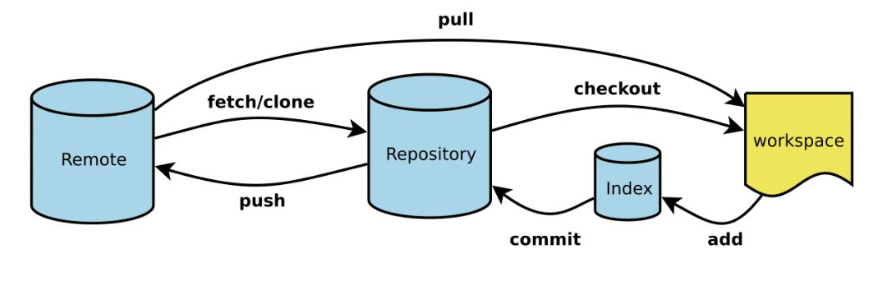
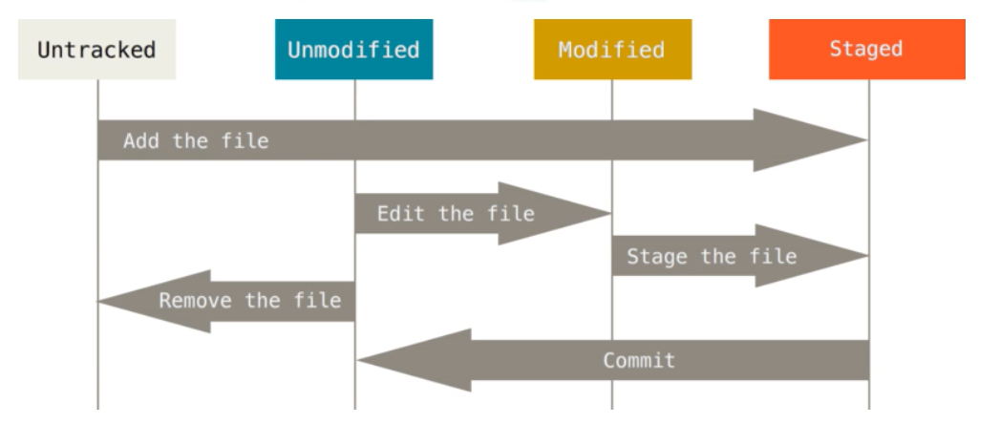
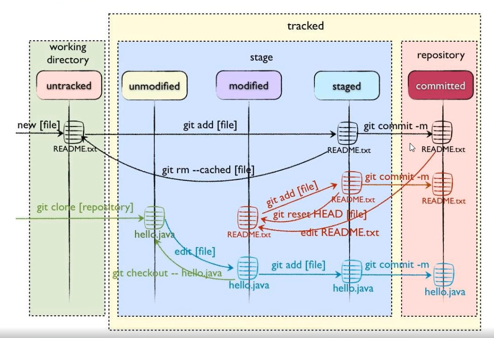
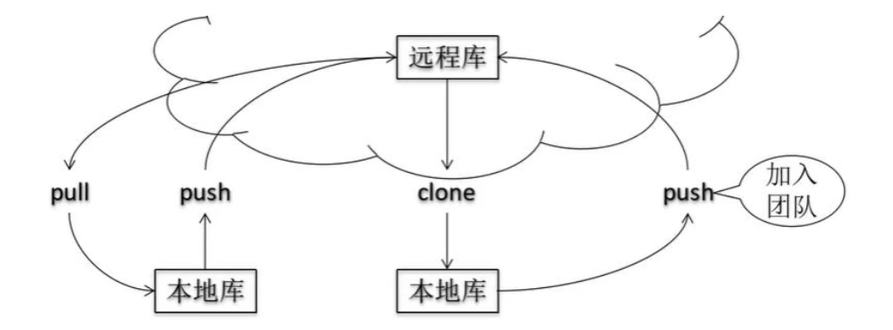
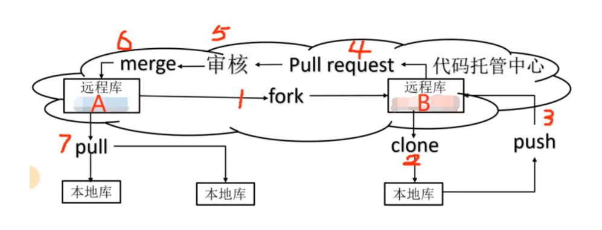

# <p style ='background-color:#894e54;text-align:center;'><font color='white'>git 介绍</font></p>

## <p style ='background-color:#8076a3;text-align:center;'><font color='white'>四个工作区域</font></p>

1. 工作目录：本地写代码的地方。
2. 暂存区：临时存放所有改动，等待提交。
3. 本地仓库：代码最终提交的终点，有提交的所有版本的数据，HEAD 默认指向最新版本。
4. 远程仓库：托管代码的服务器，可以是 GitHub、Gitee 公服，也可以是 GitLab 私服。



## <p style ='background-color:#8076a3;text-align:center;'><font color='white'>四种状态</font></p>

git 工作流程：

1. <font color='red'>工作目录</font>中添加/修改文件。
2. <font color='red'>暂存区</font>中添加工作目录中需要进行版本管理的文件。
3. <font color='red'>本地仓库</font>中添加暂存区的所有文件。

综上所述，可以得知 git 管理的文件有三种状态：

1. 已修改
2. 已暂存
3. 已提交

git 不关心文件的两个版本之间的差异，而是关心文件的整体是否有改变。

如果文件改变，则在添加提交时就生成文件新版本的快照。

判断文件整体是否改变的方法就是用 SHA-1 算法计算文件的校验和。



1. Untracked：未跟踪，文件在工作目录内，但是没有加入到 git 库，不参与版本控制。
2. Unmodified：文件未修改，文件在 git 库中，两个选择，第一个是转变为 Modified 状态；第二个是 git rm 后转变为 Untracked 状态。
3. Modified：文件已修改，两个选择，第一个是 git add 转变为 Staged 状态；第二个是 git checkout 放弃修改，从 git 库中取出文件进行覆盖，转变为 Unmodified 状态。
4. Staged：已暂存，文件提交至暂存区内，等待提交。两个选择，第一个是 git commit 转变为 Unmodified 状态；第二个是 git reset 取消暂存，转变为 Modified 状态。

四种状态的转变：



1. <font color='red'>Untracked</font>：工作目录新建文件
2. <font color='red'>Staged</font>：使用 git add 将文件添加进暂存区
3. <font color='red'>Unmodified</font>：使用 git commit 将文件添加进本地仓库
4. <font color='red'>Modified</font>：对 Unmodified 状态的文件内容修改
5. <font color='blue'>Untracked</font>：对 Unmodified 状态的文件 rm

# <p style ='background-color:#894e54;text-align:center;'><font color='white'>常用命令</font></p>

## <p style ='background-color:#8076a3;text-align:center;'><font color='white'>基本命令</font></p>

```
git status                          - 查看当前状态
git clone xxx                       - 从服务器上将代码给拉下来
git config --list                   - 看所有用户
git ls-files                        - 看已经被提交的
----------------------------------------------------------------------------
git branch                          - 查看本地所有分支
git branch -a                       - 查看所有的分支
git branch -r                       - 查看远程所有分支
git branch -D master develop        - 删除本地库 develop
git branch branch_0.1 master        - 从主分支 master 创建 branch_0.1 分支
git branch -m branch_0.1 branch_1.0 - 将 branch_0.1 重命名为 branch_1.0
git branch 删除远程 branch
git branch -r -d branch_remote_name
----------------------------------------------------------------------------
git add [file name]                 - 添加一个文件到 git index
git add .
----------------------------------------------------------------------------
git commit                          - 提交
git commit -am "init"               - 提交并且加注释
git commit -a                       - 提交当前 repos 的所有的改变
git commit -v                       - 当你用 -v 参数的时候可以看 commit 的差异
git commit -m "xxxx"                - 添加 commit 信息
git commit -a                       - -a 是代表 add，把所有的 change 加到 git index里然后再 commit
git commit -a -v                    - 一般提交命令
git commit -m "remove"              - 移除文件(从 Git 中删除)
git commit -a -m "log_message"      - (-a 是提交所有改动，-m 是加入 log 信息) 本地修改同步至服务器端
----------------------------------------------------------------------------
git remote add origin 远程仓库 SSH
git remote show origin              - 显示远程库 origin 里的资源
git remote show                     - 查看远程库
git remote add origin 远程仓库 HTTPS
git remote rename oldName newName   - 修改本地的远程仓库名
----------------------------------------------------------------------------
git pull                            - 本地与服务器端同步
git merge origin/dev                - 将分支 dev 与当前分支进行合并
git fetch                           - 相当于是从远程获取最新版本到本地，不会自动 merge
----------------------------------------------------------------------------
git push (远程仓库名) (分支名)         - 将本地分支推送到服务器上去。
git push origin master              - 将文件给推到服务器上
git push origin master:develop
git push origin master:hb-dev       - 将本地库与服务器上的库进行关联
git push origin master              - 将本地项目给提交到服务器中
git push origin :branch_remote_name
git push origin serverfix:awesomebranch
----------------------------------------------------------------------------
git checkout --track origin/dev     - 切换到远程 dev 分支
git checkout -b dev                 - 建立一个新的本地分支 dev
git checkout dev                    - 切换到本地 dev 分支
git checkout branch_1.0/master      - 切换到 branch_1.0/master 分支
----------------------------------------------------------------------------
git rm [file name]                  - 删除一个文件
git rm a.a                          - 移除文件(从暂存区和工作区中删除)
git rm --cached a.a                 - 移除文件(只从暂存区中删除)
git rm -f a.a                       - 强行移除修改后文件(从暂存区和工作区中删除)
git rm filename/filepath            - 从 git 中删除指定文件
----------------------------------------------------------------------------
git reflog                          - 看 commit 简短日志
git log                             - 看 commit 的日志
----------------------------------------------------------------------------
git diff                            - 查看尚未暂存的更新
git diff --cached                   - 查看尚未提交的更新
git diff --staged                   - 查看尚未提交的更新
----------------------------------------------------------------------------
git stash push                      - 将文件给 push 到一个临时空间中
git stash pop                       - 将文件从临时空间 pop 下来
----------------------------------------------------------------------------
du -hs

```

## <p style ='background-color:#8076a3;text-align:center;'><font color='white'>配置用户签名</font></p>

全局用户签名<font color='red'>（推荐）</font>：会在用户目录下 .gitconfig git 全局配置文件中追加签名信息。

```
git config --global user.name zhuzhumeng
git config --global user.email zhuzhumeng618@gmail.com
```

单个仓库签名：会在仓库目录下 config git 配置文件中追加签名信息。

```
git config user.name zhuzhumeng
git config user.email zhuzhumeng@gmail.com
```

## <p style ='background-color:#8076a3;text-align:center;'><font color='white'>初始化本地仓库</font></p>

`git init`

.git 文件内容：

```
|-- HEAD         # 这个 git 项目当前处在哪个分支里
|-- config       # 项目的配置信息，git config 命令会改动它
|-- description  # 项目的描述信息 ddd
|-- hooks/       # 系统默认钩子脚本目录
|-- index        # 索引文件，暂存区（stage）
|-- logs/        # 各个 refs 的历史信息
|-- objects/     # git 本地仓库的所有对象（commits, trees, blobs, tags）
|-- refs/        # 标识你项目里的每个分支指向了哪个提交（commit）。
```

HEAD 文件：这就是我们常说的HEAD指针，它指向了当前分支。

config：保存当前仓库的配置信息。

description: 仓库的描述信息。

hooks：这个目录存放一些shell脚本。

info: 包含git仓库的一些信息。

logs 文件夹，保存所有更新的引用记录。打开logs文件夹可以看到其中有两个文件，refs文件夹和HEAD文件。
refs 文件夹中有两个文件夹：

1. heads：文件里面存储的是本地分支的对象，每个对象的文件名就是本地的一个分支名。我们使用 git branch 查看本地所有分支时，查询出的分支就是 heads 文件夹下所有文件的名称，这些分支文件中存储的是对应分支下的操作记录。
2. remotes：文件夹里存储的是远程的所有分支对象，每个对象的文件名称就是远程的一个分支名称。这些分支文件中保存了远程仓库对应分支所有操作

objects：存放所有的 git 对象，哈希值一共 40 位，前 2 位作为文件夹名称，后 38 位作为对象文件名。


refs：顾名思义就是引用，refs 下有三个文件夹。

1. heads: 里面包含所有的本地分支，每个分支都是文件,文件中存储了分支当前指向的commit
2. tags: 叫做里程碑,或者版本发布用等记录重要版本。
3. remotes: 远程仓库信息

index: 暂存区（stage），是一个二进制文件。

## <p style ='background-color:#8076a3;text-align:center;'><font color='white'>查看状态</font></p>

`git status`

Changes to be committed：表示已经从工作区add到暂存区的 file（文件或文件夹），可以通过 git restore --staged filename 命令将该file从暂存区移出，只有工作区有该文件，该文件就为 Untracked files。


Changes not staged for commit：表示工作区，暂时区都存在的 file（文件或文件夹），在工作区进行修改或删除，但是没有 add 到暂存区，可以通过 git add file 命令将变更（修改，删除）的 file add 到暂存区，此时该file没有 Changes not staged for commit 状态，也就是 Changes not staged for commit 将没有改 file 的记录了。可以通过 git restore file 的命令取消在 file 在工作区的变更，那么暂存区的 file 内容还是以前的，并且 file 在 Changes not staged for commit 状态下没有记录。

Untracked files：表示只在工作区有的 file（文件或文件夹），也就是在暂时区没有该 file。

## <p style ='background-color:#8076a3;text-align:center;'><font color='white'>加入暂存区</font></p>

添加一个或多个文件到暂存区：

```
git add [file1] [file2] ...
```

添加指定目录到暂存区，包括子目录：

```
git add [dir]
```

添加当前目录下的所有文件到暂存区：

```
git add .
```

`git add .`：他会监控工作区的状态树，使用它会把工作时的**所有变化提交**到暂存区，包括文件内容修改(modified)以及新文件(new)，但不包括被删除的文件。

`git add -u`：他仅监控**已经被add的文件**（即tracked file），他会将被修改的文件提交到暂存区。`add -u` 不会提交新文件（untracked file）。（git add --update的缩写）

`git add -A`：是上面两个功能的合集（git add --all的缩写）

取消文件跟踪

```
git rm -r --cached xxx文件路径名
```

## <p style ='background-color:#8076a3;text-align:center;'><font color='white'>提交代码</font></p>

```
git commit -m [message]
```

提交指定文件：

```
git commit [file1] [file2] -m [message]
```

直接提交：

`-a` 参数设置修改文件后不需要执行 git add 命令，直接来提交

一定是要在仓库中的文件进行修改后，新增文件不行。

```
git commit -am [message]
```

回退本地提交(清除修改的内容)：

HEAD^1 表示上一次提交
HEAD^2 表示上两次提交

```
git reset origin(本地仓库名) --hard HEAD^1
```

commit_id 是提交的 hash 码

```
git reset origin(本地仓库名) --hard commit_id
```

回退本地提交(保留修改的内容)：

1 表示上一次提交
2 表示上两次提交

```
git reset origin(本地仓库名) --soft HEAD^1
```

commit_id 是提交的 hash 码

```
git reset origin(本地仓库名) --soft commit_id
```

## <p style ='background-color:#8076a3;text-align:center;'><font color='white'>版本切换</font></p>

1. 查看版本信息： `git reflog/log`
2. 切换版本： `git reset --hard 版本号`
3. 查看 .git 下面的 refs 目录： `cat ./.git/refs/heads/master`
4. 低版本切换为高版本： `git reset --hard 版本号`

# <p style ='background-color:#894e54;text-align:center;'><font color='white'>分支</font></p>

## <p style ='background-color:#8076a3;text-align:center;'><font color='white'>分支常用命令</font></p>

查看所有分支及当前所在分支：

```
git branch -v
```

创建分支：

```
git branch 新分支名
```

删除分支：

```
git branch -d 分支名
```

修改分支名称：

```
git branch -m 旧分支名 新分支名
```

切换分支：

```
git checkout 分支名
```

当前分支合并其它分支：

```
git merge 分支名
```

## <p style ='background-color:#8076a3;text-align:center;'><font color='white'>解决合并分支冲突</font></p>

产生原因：合并分支时，两个的分支在同一个位置都有修改，Git 无法判断保留哪个分支的提交。

会出现：(master|otherBranch) 分支正在进行合并的状态。

解决办法：手动修改正在合并的文件，留下需要的部分，最后再次添加到暂存区，再次提交（提交时不带文件名）

# <p style ='background-color:#894e54;text-align:center;'><font color='white'>团队协作</font></p>

## <p style ='background-color:#8076a3;text-align:center;'><font color='white'>团队内协作</font></p>



## <p style ='background-color:#8076a3;text-align:center;'><font color='white'>团队外协作</font></p>



## <p style ='background-color:#8076a3;text-align:center;'><font color='white'>创建远程库</font></p>

github / gitee 创建远程仓库

查看本地仓库关联远程仓库列表：

```
git remote -v
```

创建本地仓库关联远程仓库：

```
git remote add 别名 远程仓库地址
```

修改远程仓库别名名称：

```
git remote -v
git remote rename oldName newName
```

## <p style ='background-color:#8076a3;text-align:center;'><font color='white'>推送远程库</font></p>

```
git push 别名 分支
```
回退远程提交（都会清除远程提交的内容）

--force 和 -f 是一个意思。

保留本地修改的内容：

```
git reset --soft HEAD^
git push origin(本地仓库名) master(分支名) --force
```

或者

```
git reset --soft commit_id
git push origin(本地仓库名) master(分支名) -f
```
清除本地修改的内容：

--force 和 -f 是一个意思。

```git
git reset --hard HEAD^
git push origin(本地仓库名) master(分支名) --force
```

或者

```
git reset --hard commit_id
git push origin(本地仓库名) master(分支名) -f
```

## <p style ='background-color:#8076a3;text-align:center;'><font color='white'>拉取远程库</font></p>

```
git pull 别名 分支
```

## <p style ='background-color:#8076a3;text-align:center;'><font color='white'>克隆远程库</font></p>

```
git clone 远程仓库地址
```

## <p style ='background-color:#8076a3;text-align:center;'><font color='white'>免密登录</font></p>

1. 找到 .ssh 文件夹，一般在用户目录。
2. 生成秘钥： `ssh-keygen -t rsa -C 邮箱`
3. 复制公钥： `id_rsa.pub`
4. 在 GitHub 账号中配置： `setting` -> `SSH and GPG keys`
5. 使用 SSH 地址测试： `git pull (ssh 地址) 分支名` `git push -f (ssh 地址) 分支名`

# <p style ='background-color:#894e54;text-align:center;'><font color='white'>GitLab 私服</font></p>

版本：社区版(CE)、企业版(EE)

官网： `https://about.gitlab.com/`

## <p style ='background-color:#8076a3;text-align:center;'><font color='white'>安装与初始化</font></p>

基于 docker

下载镜像： `docker pull twang2218/gitlab-ce-zh:11.1.4`

运行容器： `docker run -d -p xxx:xxx --name xxx xxx:xxx`
