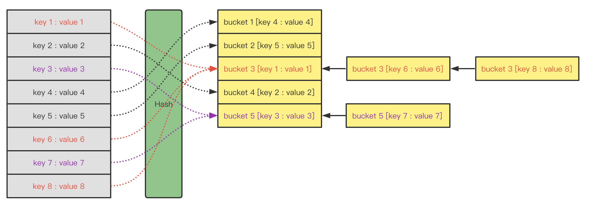
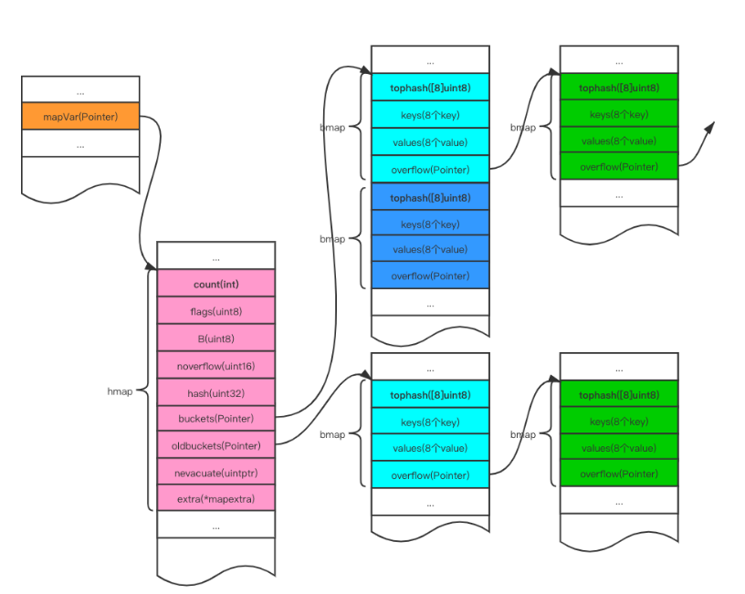

# <p style ='background-color:#894e54;text-align:center;'><font color='white'>go 优势</font></p>

高效：go 是一个静态编译型的语言，可以将源码直接编译成机器码或可执行文件，同时 go 的 GC 和 goroutine 在处理大规模任务的时候相对于其他语言而言更为高效。

并发：go 内置 goroutine 和 channel，能够很方便的编写并发程序，通道可以在多个 goroutine 间进行数据的共享，所以它在网络编程、分布式系统、大数据处理方面具有一定得优势。

简单：语法简单，没有 Java、C++ 的继承和多态、面向对象等语言特性。

可读：团队协作方面也简单，有内置的 go fmt，统一代码风格。

跨平台：交叉编译，windows 编译成 linux 可执行文件，标准库中也有与平台无关的包，如 net、io，所以可以很方便的编写跨平台程序。

# <p style ='background-color:#894e54;text-align:center;'><font color='white'>go 数据类型</font></p>

go 中数据类型分为三种：基本数据类型、复合数据类型、其它数据类型。

基本数据类型：

1. 有符号整数类型：int、int8、int16、int32、int64
2. 无符号整数类型：uint、uint8、uint16、uint32、uint64
3. 布尔数据类型：true、false
4. 浮点数据类型：float32、float64
5. 复数数据类型：complex64、complex128

复合数据类型：

1. 数组：array
2. 切片：slice
3. 映射：map
4. 接口：interface
5. 结构体：struct

其它数据类型：

1. 通道：channel
2. 字符串：string
3. 指针：pointer
4. 函数：func

# <p style ='background-color:#894e54;text-align:center;'><font color='white'>go 包使用</font></p>

包是代码的组织单元，每一个 go 的源文件都属于一个包，并且在源文件第一行使用 package 关键字声明源文件所属的包。

包中定义的任何可见的变量、函数、类型都可以被其他包进行引用。

1. 导入包：import 关键字可以用来导入需要使用的包。
2. 使用包：通过 package 定义的包名/或者在 import 时定义的包别名通过 . 选择器的方式进行使用包中函数、变量。
3. 自定义包：package xxx，编写需要公开的函数或变量，在代码中定义 init 函数。

# <p style ='background-color:#894e54;text-align:center;'><font color='white'>go 类型转换</font></p>

go 不支持隐式的类型转换，只能通过 类型() 的方式进行类型显式转换。

数值之间转换：支持整数与浮点之间的转换，但会损失精度。

字符串转整数：通过标准库 strconv 进行转包，这个包包括 atob、atoc、atof、atoi 的转换。

指针之间转换：需要用到 unsafe 包的 Pointer 函数。

自定义类型之间的转换：底层数据类型必须相同，通过类型的自定义函数进行转换。

# <p style ='background-color:#894e54;text-align:center;'><font color='white'>go 如何停止 goroutine</font></p>

goroutine 是 go 中的协程，也就是一个轻量级的线程，相比于传统线程，goroutine 创建和销毁的代价非常低，可以同时创建成千上万个协程，不会导致系统负担过重。

goroutine 开启也很方便，通过关键字 go 来启动一个协程，会在一个独立的栈空间执行响应的函数，可以在函数中执行阻塞和非阻塞操作。

在 goroutine 中使用通道来接收停止信号，当主线程需要停止 goroutine 时，向通道发送一个信号即可，goroutine 不断检测该通道是否有信号，如果有信号，立即退出。

主线程通过向 channel 中传递信号的方式可以关闭协程：

1. 通过 context.Context 关闭协程。
2. 通过 channel bool 关闭协程。
3. 通过 channel close 关闭协程。

# <p style ='background-color:#894e54;text-align:center;'><font color='white'>go 运行时检查变量类型</font></p>

reflect 反射技术是一种可以在程序运行期间检查变量类型、变量值的一个技术，可以在不清楚变量具体类型时操作内部数据。

通过 TypeOf 函数可以获取到变量的类型。

通过 ValueOf 函数可以获取到变量的值。

反射可能会带来一定得性能损失，尽量过度使用反射，编码时尽可能使用静态类型检查，避免在运行时进行类型检查和转换。

# <p style ='background-color:#894e54;text-align:center;'><font color='white'>go 接口之间可以存在的关系</font></p>

接口是一组由不同方法签名构成的一个集合。

嵌套：接口的嵌套可以包含嵌套接口(B 嵌套 A)的所有方法，B 的实现类必须实现 (B + A) 的所有方法，才能是实现了 B。

扩展：嵌套为前提，B 嵌套 A，A 可以通过在 B 接口中扩展新方法达到 A 接口的扩展。

嵌套是指：接口作为其他接口的一部分，其它接口拥有这个接口的所有方法，并可以新增新方法。

扩展是指：接口在其他接口上进行方法的扩展，实现类必须实现新添加的方法。

类型转换：接口除接口名不一致外，方法签名全部相同，则可以进行接口的转换。

接口实现：一个接口可以被多个不同的类型实现。

注意：接口与接口间没有继承，而是通过包含相同的方法集合来建立联系。

# <p style ='background-color:#894e54;text-align:center;'><font color='white'>go 同步锁特点</font></p>

同步锁是一种并发编程技术，可以保证多个 goroutine 之间对共享数据的安全访问，在 go 中主要是通过 sync 包中的 Mutex 类型进行实现。

同步锁的特点：

1. 互斥：这个特性保证了同一时刻只能有一个 goroutine 持有锁，其它 goroutine 需要等到当前 goroutine 释放锁。
2. 阻塞：锁被持有时，当前尝试获取锁的 goroutine 将会被阻塞，直到锁被释放。
3. 公平：锁的获取是公平的，即锁会按照申请的先后顺序分配给等待的 goroutine，避免了其它 goroutine 无法获取锁的情况。

同步锁的作用是保护共享数据，避免多个 Goroutine 同时对共享数据进行修改而导致的竞争条件和数据竞争问题。

在需要保证共享数据的安全访问时，可以使用同步锁来对临界区进行加锁，以避免并发修改数据产生的问题。

在使用同步锁时，需要注意避免死锁和饥饿等问题的发生，同时需要合理地设计锁的粒度和作用域，避免锁的竞争导致性能下降。

# <p style ='background-color:#894e54;text-align:center;'><font color='white'>go channel</font></p>

**channel 是 goroutine 之间通信和同步的机制，channel 特点：**

线程安全：channel 可以安全的在 goroutine 之间传递数据，避免了数据竞争和死锁等问题。

阻塞式：当 channel 中没有数据时，读取操作会被阻塞，直到 channel 中有数据可读，当 channel 已满时，会对写操作进行阻塞，直到有空间可以进行写入。

有缓冲和无缓冲：不带缓冲的 channel 可以保证每次写入和读取都是同步的；带缓冲的 channel 可以在缓冲区未满时进行写入操作而不阻塞，直到缓冲区满时再阻塞写入操作。

可关闭：channel 可以被显式的关闭，以通知 channel 的接收方不再有数据可读，避免接收方被永久地阻塞。

**使用 channel 需要注意的问题：**

避免死锁：当使用 channel 进行 goroutine 之间的通信和同步时，需要确保不会出现死锁的情况；可以使用 select 语句和超时机制等方式来避免 channel 阻塞问题。

避免竞态条件：当多个 Goroutine 访问同一个 Channel 时，需要注意避免竞态条件的发生；可以使用 Mutex 和 sync 包中提供的其他同步机制来避免并发访问 channel 导致的问题。

合理使用缓冲：当使用带缓冲的 channel 时，需要根据实际需要设置缓冲区的大小，避免缓冲区过大或过小导致的性能问题。同时需要注意，当 channel 中的数据过多时，会导致内存占用过高，需要及时清理不必要的数据。

避免 channel 泄漏：当使用 channel 时，需要注意避免 channel 泄漏的问题，即在不需要使用 channel 时及时关闭 channel，避免 channel 占用过多的系统资源。

# <p style ='background-color:#894e54;text-align:center;'><font color='white'>go channel 带缓冲</font></p>

在 Go 语言中，channel 缓冲是指在创建 channel 时设置的缓冲区大小。带缓冲的 channel 可以在缓冲区未满时进行写入操作而不阻塞，直到缓冲区满时再阻塞写入操作。

可以提高并发性能：使用带缓冲的 channel 可以提高并发程序的性能，因为缓冲区可以暂时存储数据，避免了每次数据传输时都需要阻塞等待的情况。这种方式特别适用于生产者-消费者模式，其中生产者的产生速度快于消费者的处理速度，缓冲区可以暂时存储一定量的数据，使得生产者和消费者的速度可以适度地解耦。

缓冲区大小需要合理设置：channel 缓冲区大小的设置需要根据实际应用场景进行合理的选择，过小的缓冲区可能会导致生产者被阻塞，过大的缓冲区可能会导致内存占用过高。一般来说，需要根据实际情况进行调整，以达到最优的性能表现。

带缓冲的 channel 可能会出现死锁问题：当使用带缓冲的 channel 进行 goroutine 之间的通信和同步时，需要注意避免死锁的问题。因为带缓冲的 Channel 可以在缓冲区未满时进行写入操作，如果生产者写入数据的速度过快，可能会导致缓冲区已满而阻塞生产者，此时如果消费者已经不再消费数据，整个程序就会进入死锁状态。

可以使用 close() 函数关闭 channel：当使用带缓冲的 channel 时，需要注意及时清理缓冲区中的数据，可以使用 close() 函数来显式地关闭 channel。关闭 channel 会使得 channel 中未被读取的数据被丢弃，并且后续的写入操作会导致 panic 异常。

# <p style ='background-color:#894e54;text-align:center;'><font color='white'>go cap</font></p>

1. 数组：cap 函数返回数组长度。
2. 切片：cap 函数返回切片容量。
3. 通道：cap 函数返回 channel 的容量，也就是 channel 缓冲区的大小。

只能作用于包含指针的数据类型，如数组、切片、通道，而不能用于值类型的数据类型。

# <p style ='background-color:#894e54;text-align:center;'><font color='white'>go new</font></p>

new 是 golang 中的内置函数，可以创建一个变量/类型对应的指针，值为零值，类型为该类型的指针类型。

new 返回一个指向新变量的指针，该变量的值为其类型的零值。在 Go 语言中，每个变量都有一个类型和一个值，而 new 可以用于创建变量的指针。

new 的作用在于在堆上分配内存空间，而不是在栈上分配。

使用 new 函数创建变量时，返回的指针指向在堆上分配的变量，即使该变量在函数调用结束后仍然存在。

因此，new 通常用于创建结构体、数组和其他复杂数据类型的指针。

需要注意的是，new 只能创建变量的指针，而不能用于创建变量本身。如果需要创建变量本身，可以使用变量声明语句。

# <p style ='background-color:#894e54;text-align:center;'><font color='white'>go make</font></p>

make 是 golang 中的内置函数，可以为 slice、map、channel 这三种类型进行初始化操作。

需要注意的是，使用 make 函数创建的数据结构是分配在堆上的，并返回一个引用，即一个指向数据结构的指针。

这与使用 new 函数创建变量的方式不同，因为 new 只分配了变量所需的内存空间，而 make 既分配了变量所需的内存空间，又初始化了变量的其他属性。

因此，make 更适用于创建 slice、map 和 channel 等复杂的数据结构。

# <p style ='background-color:#894e54;text-align:center;'><font color='white'>go 数组与切片的区别</font></p>

长度：数组长度不可变，slice 有扩容机制。

分配内存：数组在声明时就会分配一段连续的内存空间。切片是动态的数据结构，底层是一个指向底层数组的指针、长度和容量，容量可以随元素的增加而自动扩容。

传递方式不同：数组作为函数形参时，传递的是拷贝此数组的一个副本，在函数内部对数组进行修改不会改变原有的数组值；切片作为函数形参时，传递的是拷贝切片的底层指针、长度、容量，在函数内部对切片进行修改会改变原有切片的值。

声明方式不同：array 使用 new 或者普通的，slice 必须使用 make 进行初始化。

综上所述，数组和切片都有自己的特点和优缺点，需要根据具体的需求来选择合适的数据结构。如果需要存储一组固定长度的元素，可以使用数组；如果需要动态增长和缩减元素，可以使用切片。

# <p style ='background-color:#894e54;text-align:center;'><font color='white'>go 值传递和地址传递</font></p>

值传递：在通过函数传参时，传递的是值的拷贝，在函数中修改参数的值不会影响原始值，golang 中基本数据类型、数组、结构体采用的都是值传递。

地址传递：在通过函数传参是，传递的是地址的拷贝，在函数中修改参数的值会影响原始值，golang 中 slice、map、pointer 类型是以地址传递。

使用值传递还是地址传递需要根据实际情况来决定，一般来说，如果参数是一个大型的结构体或者数组，使用地址传递可以避免值的拷贝，提高程序的效率。如果参数是一个简单的值类型，使用值传递即可。

# <p style ='background-color:#894e54;text-align:center;'><font color='white'>go 切片扩容</font></p>

当切片容量不足时，go 会为切片重新分配一个更大的内存空间，通常情况下，新空间为原来空间的 2 倍，然后将数据复制到新空间内，并在新空间最末尾添加新元素，最后返回新切片，切片的底层指针会指向新的底层数组。

需要注意的是，切片的扩容可能会导致底层数组重新分配内存空间，并将原来的数据复制到新的内存空间中，因此扩容操作的时间复杂度为 O(n)，其中 n 表示切片的长度。因此，如果需要对一个大型的切片进行频繁的扩容操作，可能会对程序的性能产生影响。为了避免这种情况，可以在创建切片时尽可能地指定切片的容量，或者使用数组来代替切片。

扩容条件：

切片的扩容条件：在使用 append 函数追加元素时，如果当前元素个数达到了底层数组容量，就会触发切片的扩容机制。

切片底层的数组容量在创建切片时确定，当切片长度小于底层数组容量时，不进行扩容；当切片长度大于底层数组容量时，触发扩容。

切片的扩容规则是将底层数组的容量翻倍，但是在实际扩容过程中，可能会存在一些优化策略，例如：在容量小于 1024 时，每次扩容增加 1 倍容量；在容量大于 1024 时，每次扩容在原容量基础上增加 25% 容量等等，这些细节 golang 会在运行时根据实际情况进行调整，用户不需要过多关注。

# <p style ='background-color:#894e54;text-align:center;'><font color='white'>go defer</font></p>

多个 defer 语句，遵从后进先出(Last In First Out，LIFO)的原则，最后声明的 defer 语句，最先得到执行。

**defer 在 return 语句之后执行**，但在函数退出之前，defer 可以修改返回值。

无名返回值：defer 不会修改 return 值。
有名返回值：defer 会修改 return 值。

# <p style ='background-color:#894e54;text-align:center;'><font color='white'>go slice 底层实现</font></p>

slice 是基于数组的数据结构，结构体内部构造为：指向底层数组的指针、长度、容量，slice 的底层实现是一个动态数组，可以动态地增长和缩小，同时具有数组的索引和迭代操作的优点。

slice 创建时，golang 会为其分配一块连续的内存空间用于存储数据，并返回一个指向该内存区域的指针，该指针被称为 slice 的底层指针，slice 还会记录该内存区域的长度、容量。

在 slice 容量不足以存储新的元素时，Go 语言会自动重新分配一块更大的内存区域，并将原有的元素复制到新的内存区域中，然后将新的元素添加到新的内存区域中。这种自动扩容机制使得 slice 的大小可以根据需要自动调整，无需手动进行内存分配和释放操作，同时也保证了 slice 的连续性，使得它在访问和遍历元素时具有更好的性能表现。

需要注意的是，由于 slice 是对底层数组的引用，因此多个 slice 可以共享同一个底层数组。这种特性使得 slice 在函数之间传递时非常高效，同时也需要注意避免对 slice 中的元素进行修改，从而影响到其他共享同一个底层数组的 slice。

# <p style ='background-color:#894e54;text-align:center;'><font color='white'>go slice 扩容机制注意点</font></p>

切片的扩容机制是在原切片容量的基础上扩容，一般是 2 倍或 1.5 倍，具体扩容的倍数由实现算法决定，注意点：

1. 切片扩容会重新分配一块连续的内存空间，因此需要将原切片中的元素复制到新的内存空间中，这个过程可能会比较耗时。
2. 在使用 append 函数添加元素时，如果元素的总个数超过了容量，则触发扩容机制。
3. 切片扩容会导致原切片和返回的新切片指向不同的底层数组，因此原切片的修改不会影响新切片的值。
4. 切片扩容不是每次添加元素都会触发，而是当切片容量不足以容纳更多元素时才会触发。
5. 当切片容量小于 1024 时，扩容时新的容量会翻倍，当容量大于等于 1024 时，新的容量会增加原容量的 1/4，也就是乘以 1.25。
6. 由于切片底层是基于数组实现的，因此切片扩容时，如果原数组的容量不足以容纳新的元素，也会触发数组的重新分配和拷贝。

# <p style ='background-color:#894e54;text-align:center;'><font color='white'>go slice 扩容前后是否相同</font></p>

在 Golang 中，扩容前后的 Slice 是不同的。在进行 Slice 扩容时，会创建一个新的底层数组，并将原来的元素拷贝到新的数组中。因此，扩容前后的 Slice 指向的底层数组是不同的。

Golang 中的 Slice 是基于数组实现的，因此在创建 Slice 时，底层会创建一个数组来存储数据。当 Slice 中的元素个数超过底层数组的容量时，就需要进行扩容。而在 Golang 中，数组的大小是固定的，无法进行扩容，因此需要创建一个新的底层数组，并将原来的元素拷贝到新的数组中。这样就可以实现 Slice 的扩容了。由于扩容后底层数组的地址已经发生了变化，因此扩容前后的 Slice 底层数组是不同的，即扩容前后的 Slice 不再共享底层数组。

# <p style ='background-color:#894e54;text-align:center;'><font color='white'>go 参数传递、引用传递</font></p>

在 Golang 中，函数调用时参数传递可以分为值传递和引用传递。

值传递：将参数的值复制一份，然后将复制的值传递给函数，函数对参数的修改不会影响到原始的值。常见的值类型如 int、float、bool 等都是值类型，它们的传递都是值传递。

引用传递：将参数的地址复制一份，然后将复制的地址传递给函数，函数对参数的修改会影响到原始的值。常见的引用类型如 Slice、map、Channel、指针等都是引用类型，它们的传递都是引用传递。

需要注意的是，在 Golang 中数组虽然是引用类型，但是它的传递却是值传递。这是因为 Golang 的数组长度是固定的，数组的值复制时会将整个数组的元素都复制一遍，因此传递数组时的开销较大，而且数组的长度也不可变，因此将数组的地址复制一份也无法修改原数组的长度，所以 Golang 采用了值传递的方式。

总之，对于值类型的参数，使用值传递即可；对于引用类型的参数，使用引用传递可以避免大量数据的复制，提高程序的效率。同时，在使用引用类型的参数时，需要注意并发访问的问题。

# <p style ='background-color:#894e54;text-align:center;'><font color='white'>go map 底层实现</font></p>

map 描述了一种键与值的映射关系，开发者通常会通过键来查询其对应的值。map 最常见的底层实现有两种：基于 **Hash 散列**和基于**平衡树**，两者的存取时间复杂度不同，Go 语言的 map 属于前者范畴。

Go 语言 map 的底层实现基于 Hash 散列。Hash 散列是一种著名的广义上的算法，它能够将**任意长度的数据映射**到**有限的值域**上面。

Hash 算法有两大核心：设计 Hash 函数和解决 Hash 冲突。

一个map 中会包含很多桶，每个桶中可以存放8个键值对。

**注意：键不重复 & 键必须可哈希（int/bool/float/string/array）**

设计 Hash 函数：

基本原则：

1. 尽可能让输入的数据映射到不同的值域上面。
2. 函数计算过程需要保证高性能。

但实际工程中由于输入数据范围是无限的，而输出值域范围是有限的，因此必然存在不同的输入数据经过映射后得到相同的输出值，这种现象称为 Hash 冲突。


常见的著名 Hash 算法还有：MD5、SHA1、SHA2 等等。

Java 中 Hashmap：


Go 中 map：


解决 Hash 冲突：

如何解决 Hash 冲突是 Hash 算法中的核心一环，最常见的做法是拉链法。所谓拉链法是指当 Hash 冲突产生时，将出现冲突的 Bucket 位用链表这一数据结构串联。



go 哈希函数：

map 的一个关键点在于，哈希函数的选择。在程序启动时，会检测 cpu 是否支持 aes，如果支持，则使用 aes hash，否则使用 memhash。这是在函数 alginit() 中完成，位于路径：src/runtime/alg.go 下。

hash 函数，有加密型和非加密型。

加密型的一般用于加密数据、数字摘要等，典型代表就是 md5、sha1、sha256、aes256 这种。

非加密型的一般就是查找。在 map 的应用场景中，用的是查找。

选择 hash 函数主要考察的是两点：性能、碰撞概率。

Go 语言中的 map 是一种无序的键值对的集合，底层实现使用了哈希表（hash table）。

具体来说，Go 语言中的 map 实际上是一个指向哈希表的指针。哈希表本身是由若干个桶（bucket）组成的，每个桶包含了若干个键值对，每个键值对由一个 key 和一个 value 组成。在对 map 进行读写操作时，Go 语言会根据 key 计算出它在哈希表中的位置，然后直接访问对应的桶，从而实现高效的访问。

需要注意的是，Go 语言中的 map 不是线程安全的，因此在多线程并发访问时需要使用锁等机制来保证安全。

另外，由于哈希表的大小是固定的，因此当 map 中的元素数量达到一定程度时，需要对哈希表进行扩容。

# <p style ='background-color:#894e54;text-align:center;'><font color='white'>go map 扩容</font></p>

在 Golang 中，map 的底层实现是使用哈希表（Hash Table）实现的。在插入新元素时，如果当前 map 中的元素个数达到了当前 map 所能容纳的最大元素个数，就会触发扩容操作。

map 的扩容操作会重新创建一个更大的哈希表，并将旧哈希表中的元素重新哈希到新的哈希表中。同时，新哈希表的大小一定是旧哈希表大小的两倍，因为 Golang 采用了指数级扩容策略，每次扩容后 map 可以容纳的元素个数是之前的两倍。

当 map 进行扩容时，由于哈希表中的元素需要重新哈希到新的哈希表中，因此会涉及到大量的内存复制操作，导致性能下降。为了减少这种情况的发生，Golang 中的 map 实现采用了增量式哈希算法，可以在扩容时只复制新增的元素，从而提高性能。

需要注意的是，在 map 进行扩容时，可能会导致哈希冲突的数量增加，因此扩容后的 map 的性能可能会有所下降。为了避免这种情况，可以考虑在创建 map 时指定初始容量，以减少扩容的次数。

# <p style ='background-color:#894e54;text-align:center;'><font color='white'>go map 查找</font></p>

在 Go 语言中，使用 map 查找一个键值对的过程可以通过 `map[key]` 来完成，返回值是对应的值和一个表示是否存在的布尔值。

具体来说，如果 map 中存在该键，则返回对应的值和布尔值 `true`；如果不存在该键，则返回值类型的零值和布尔值 `false`。

需要注意的是，map 的键类型必须支持相等运算，例如，数字、字符串、指针、通道、接口类型、结构体类型等都是支持的，但是数组、切片、函数类型等不支持。

在 Golang 中，map 的查找是通过哈希表实现的。当程序执行 map 查找操作时，会先根据哈希函数将 key 转换成一个哈希值，然后在哈希表中查找该哈希值对应的桶(bucket)，再在桶中查找对应的键值对。

具体来说，当 map 中的键值对数量超过一定阈值时，会触发自动扩容操作。扩容操作会重新分配更大的桶数组，并将原有的键值对重新哈希分布到新的桶中。

在查找时，Golang 的 map 会先通过哈希值定位到对应的桶(bucket)，然后在桶中遍历链表（每个桶可能对应多个键值对）查找对应的键值对。在遍历链表的过程中，如果发现某个键值对的 key 与要查找的 key 相等，则返回该键值对的 value。

需要注意的是，如果 map 中的键值对过多，桶中的链表会很长，查找时效率会降低，因此需要根据实际情况合理设置 map 的容量和哈希函数，以充分利用哈希表的优势。同时，当 map 中的键值对类型为复杂类型（如结构体）时，需要重载对应的哈希函数和比较函数，以确保哈希表的正确性。

# <p style ='background-color:#894e54;text-align:center;'><font color='white'>go 介绍 channel</font></p>

go 语言中的 channel 是用于多个 goroutine 之间进行通信的一种机制，通过 channel 可以在多个 goroutine 间安全地传递数据。

channel 是一种类型，可以使用内置的 make() 函数来创建它们，创建 channel 时，需要指定它们可以传输的数据类型。

使用 channel 时，可以在 goroutine 之间传递数据，通过它们进行同步（无缓冲）和异步（有缓冲）的操作，在使用 channel 时需要注意以下几点：

1. channel 是引用类型，可以像 slice 和 map 一样传递给函数。
2. 默认情况下，channel 是无缓冲的，只有当 goroutine 接收端准备好接收数据时，goroutine 发送端发送操作才会成功，如果发送操作没有被接收，goroutine 发送端将会阻塞。
3. 通过 make() 函数创建带缓冲的 channel 时，可以指定缓冲区的大小，在缓冲区没有被填满前，发送操作不会阻塞。
4. channel 支持多路复用，使用 select 语句在多个 channel 上进行选择和等待。
5. channel 可以用于控制 goroutine 的执行，例如通过关闭 channel 来通知 goroutine 退出。

# <p style ='background-color:#894e54;text-align:center;'><font color='white'>go channel ring buffer</font></p>

channel 会被实现为一个 FIFO 队列，当向 channel 发送数据时，数据会被添加到队列的末尾，当从 channel 接收数据时，数据会被从队列的头部取出。

go 1.3 版本中，新增了一种环形缓冲区(ring buffer)的 channel 实现方式，可以用于提高 channel 的性能，具体来说，当创建一个缓冲区大小为 n 的 channel 时，go 会为其分配一个大小为 n 的环形缓冲区，而不是一个简单的队列。

使用环形缓冲区实现 channel 有以下几个好处：

1. 避免动态内存分配：在缓冲区大小确定的情况下，环形缓冲区可以在创建时一次性分配所需的内存，避免了频繁的动态内存分配和释放操作，从而提高了性能。
2. 提高缓存命中率：环形缓冲区会将元素放置在连续的内存块中，这样可以提高缓存命中率，从而减少缓存访问延迟，提高了通信的效率。
3. 支持无锁访问：由于 channel 是在多个 goroutine 之间进行通信的，因此通常会涉及到并发访问的问题，环形缓冲区的视线可以采用无锁算法，从而避免了锁竞争带来的开销，提高了并发访问的效率。

需要注意的是，使用环形缓冲区实现 channel 也有一些限制和注意事项。例如，缓冲区大小必须是 2 的幂次方，否则可能会导致缓冲区溢出或者浪费内存等问题。同时，对于特殊的 channel 操作，如 close、select 和带缓冲区的 channel 等，也需要注意环形缓冲区的使用方式。

ring buffer 是一种循环缓冲区，当达到缓冲区的末尾时，可以从头端重新开始写入数据。这样，可以避免缓冲区溢出的问题，并且在写入和读取数据时保持高效的性能。

在使用 ring buffer 时，需要确保写入数据的速度不会超过读取数据的速度，否则可能会导致 buffer 溢出的问题。因此，在使用 ring buffer 时需要仔细考虑数据流的速度和大小。

# <p style ='background-color:#894e54;text-align:center;'><font color='white'>go 方法和函数的区别</font></p>

方法是一个包含接收者参数的函数，为指定的接收者提供一些行为处理；

函数是一段代码，可被调用并接收参数和返回结果。

与方法不同，函数没有接收者参数，因此它们无法直接修改调用者的状态。函数在 go 语言中是一等公民，可以像任何其他类型的值一样被传递和赋值。函数还可以是匿名的，或者被作为闭包使用，以便在不同的作用域中进行操作。

# <p style ='background-color:#894e54;text-align:center;'><font color='white'>go 指针接收者和值接收者</font></p>

值接收者会在方法调用时会对接收者进行复制，当方法内部存在对接收者的修改操作时，不会改变原有接收者的数据。

指针接收者避免了在方法调用时对接收者复制的操作，从而提高程序的性能，当方法内部存在对接收者的修改操作时，会改变原有接收者的数据。

1. 不想改变接收者数据时用值接收者，需要改变接收者数据时使用指针接收者。
2. 看自己的编码习惯。

# <p style ='background-color:#894e54;text-align:center;'><font color='white'>go 函数返回局部变量的指针是否安全</font></p>

一般来说，局部变量会在函数返回后被销毁，因此被返回的指针就成为了“无所指”的引用，程序会进入未知状态。

但这在 go 中是安全的，go 编译器将会对每个局部变量进行逃逸分析。如果发现局部变量的作用域超出该函数范围，则不会将内存分配在栈上，而是分配在堆上，因为他们不在栈区，所以即使释放函数，其内容也不会受影响。

编译时可以借助选项 -gcflags=-m，查看变量逃逸的情况。

# <p style ='background-color:#894e54;text-align:center;'><font color='white'>go 函数传参到底是值传递还是引用传递</font></p>

go 只有值传递。

引用类型和引用传递是有区别的。

函数使用指针参数时，指针自身的地址是被复制了一份，这个地址是不同的，但是指针内部存储的变量地址是没有变化的，还是指向原有变量的内存空间。

slice 类型：形参和实际参数内存地址一样，不代表是引用类型；下面进行详细说明 slice 还是值传递，传递的是指针，是一个结构体，他的第一个元素是一个指针类型，这个指针指向的是底层数组的第一个元素。当参数是 slice 类型的时候，fmt.printf 通过 %p 打印的 slice 变量的地址其实就是内部存储数组元素的地址，所以打印出来形参和实参内存地址一样。

因为 slice 作为参数时本质是传递的指针，上面证明了指针也是值传递，所以参数为 slice 也是值传递，指针指向的是同一个变量，函数内对形参的修改，会修改原内容数据。

单纯的从 slice 这个结构体看，我们可以通过 modify 修改存储元素的内容，但是永远修改不了 len 和 cap，因为他们只是一个拷贝，如果要修改，那就要传递 &slice 作为参数才可以。

map 类型：形参和实际参数内存地址不一样，证明是值传递，通过 make 函数创建的 map 变量本质是一个 hmap 类型的指针 *hmap，所以函数内对形参的修改，会修改原内容数据。

channel 类型：形参和实际参数内存地址不一样，证明是值传递，通过 make 函数创建的 chan 变量本质是一个 hchan 类型的指针 *hchan，所以函数内对形参的修改，会修改原内容数据。

struct 类型：形参和实际参数内存地址不一样，证明是值传递。形参不是引用类型或者指针类型，所以函数内对形参的修改，不会修改原内容数据。

# <p style ='background-color:#894e54;text-align:center;'><font color='white'>go defer 关键字的实现原理</font></p>

defer 能够让我们推迟执行某些函数的调用，推迟到当前函数返回前才执行。

defer、panic、recover 结合，形成了 go 语言风格的异常与捕获机制。

优点：方便开发者使用。

缺点：有性能损耗。

Go1.14 中编译器会将 defer 函数直接插入到函数的尾部，无需链表和栈上参数拷贝，性能大幅提升。把 defer 函数在当前函数内展开并直接调用，这种方式被称为 open coded defer（开放编码延迟）

函数退出前，按照先进后出的顺序，执行 defer 函数。

panic 后的 defer 函数不会被执行（遇到 panic，如果没有捕获错误，函数会立刻终止）

panic 没有被 recover 时，抛出的 panic 到当前 goroutine 最上层函数时，最上层程序直接异常终止。

panic 有被 recover 时，当前 goroutine 最上层函数正常执行。

# <p style ='background-color:#894e54;text-align:center;'><font color='white'>go make 和 new 的区别</font></p>

make 和 new 是内置函数，不是关键字。

变量初始化两步：变量声明 + 变量内存分配。

var 关键字用来声明变量的，new 和 make 函数主要是用来分配内存的。

var 声明值类型时，系统会默认分配内存空间，并赋值该类型的零值。

var 声明引用类型和指针类型时，系统不会分配内存空间，默认就是 nil，如果直接进行使用，系统会发生错误，必须进行内存分配后才能使用。

new 和 make 两个内置函数，主要用来分配内存空间，有了内存，变量就能使用了。

使用场景的区别：

make 只能用来分配及初始化 slice、map、chan 的数据。

new 可以分配任意类型的数据，并且置零。

sli 也可以使用 new 进行内存分配，但是长度和容量都为 0，只能通过内置的 append 函数进行使用。

map 也可以使用 new 进行内存分配，但不能使用。

返回值的区别：

make 函数原型如下：返回的是 slice、map、chan 类型本身。

这 3 中类型就是引用类型，没有必要返回他们的指针。

new 函数返回一个指向该类型内存地址的指针。

# <p style ='background-color:#894e54;text-align:center;'><font color='white'>go slice 的底层实现原理</font></p>

切片是基于数组实现的，底层是数组，可以理解为对底层数组的抽象。

runtime/slice.go

```
type slice struct {
    array unsafe.Pointer
    len   int
    cap   int
}
```

slice 占用 24 个字节 

array：指向底层数组的指针，占用 8 个字节。

len：slice 的长度，占用 8 个字节。

cap：slice 的容量，cap 总是大于等于 len，占用 8 个字节。

4 种初始化方式。

var、:=、make、arr\[0:3]

通过 go tool compile 得到汇编代码。

初始化 slice 调用的是 runtime.makeslice，makeslice 函数的工作主要就是计算 slice 所需内存大小，然后调用 mallocgc 进行内存的分配。

所需内存大小 = 切片中元素大小 * 切片的容量

# <p style ='background-color:#894e54;text-align:center;'><font color='white'>go array 和 slice 区别</font></p>

长度不同：

数组初始化必须指定数组长度，并且长度固定不可变。

切片舒适化无需指定切片长度，可以追加元素，在追加时，底层会根据扩容策略进行自动扩容。

函数传参方式不同：

数组是值类型，将一个数组赋值给另一个数组时，传递的是一份深拷贝，函数传参操作都会复制整个数组数据，会占用额外的内存，函数内对数组元素值的修改，不会修改原数组内容。

切片是引用类型，将一个切片复制给另一个切片时，传递的是一份浅拷贝，函数传参操作不会复制整个切片，只会复制 len 和 cap，底层共用同一个底层数组数据，不会占用额外的内容，函数内对数组元素值的修改，会修改原数组内容。

计算长度方式不同：

数组需要遍历计算数组长度，时间复杂度为 O(n)

切片底层包含 len 字段，可以通过 len() 计算切片长度，时间复杂度为 O(1)

# <p style ='background-color:#894e54;text-align:center;'><font color='white'>go slice 深拷贝和浅拷贝</font></p>

深拷贝：拷贝的是数据本身，创造一个新对象，新创建的对象与源对象不共享内存，新创建的对象在内存中开辟一个新的内存地址，新对象值修改时不会影响原对象值。

实现深拷贝方式：

1. 使用内置函数 copy(dst,src []Type)；
2. 遍历 append 赋值。

浅拷贝：拷贝的是数据地址，只复制指向的对象的指针，此时新对象和老对象指向的内存地址是一样的，新对象值修改时老对象也会变化。

实现浅拷贝方式：引用类型的变量，默认赋值操作就是浅拷贝。

# <p style ='background-color:#894e54;text-align:center;'><font color='white'>go slice 扩容机制</font></p>

扩容会发生在 slice append 时候，当 slice 的 cap 不足以容纳新元素，就会进行扩容，扩容规则如下：

1. 如果新申请的容量比原有容量的两倍大，那么扩容后容量大小为新申请的容量；
2. 如果原有 slice 长度小于 1024，那么每次就扩容为原来的 2 倍；
3. 如果原有 slice 长度大于等于 1024，那么每次扩容就扩为原来的 1.25 倍。

新版本为 256。

# <p style ='background-color:#894e54;text-align:center;'><font color='white'>go slice 为什么不是线程安全的</font></p>

线程安全定义：

1. 多个线程访问同一个对象时，调用这个对象的行为都可以获得正确的结果，那么这个对象就是线程安全的。
2. 若有多个线程同时执行写操作，一般都需要考虑线程同步，否则的话就可能影响线程安全。

go 实现线程安全常用的几种方式：

1. 互斥锁
2. 读写锁
3. 原子操作
4. sync.once
5. sync.atomic
6. channel

slice 底层结构并没有使用加锁等方式，不支持并发读写，所以并不是线程安全的，使用多个 goroutine 对类型为 slice 的变量进行操作，每次输出的值大概率都不会一样，与预期值不一致; slice 在并发执行中不会报错，但是数据会丢失。

# <p style ='background-color:#894e54;text-align:center;'><font color='white'>go map 底层实现原理</font></p>

map 是一个指针，占用 8 个字节，指向 hmap 结构体。

源码包 `runtime/map.go` 定义了 hmap 的数据结构：

hmap 包含若干个结构为 bmap 的数组，每个 bmap 底层都采用链表结构，bmap 通常叫其 bucket(桶)

hmap 结构体：

```
// A header for a Go map.
type hmap struct {
    count      int            // 代表哈希表中的元素个数，调用 len(map) 时，返回的就是该字段值。
    flags      uint8          // 状态标志（是否处于正在写入的状态等）
    B          uint8          // buckets（桶）的对数，如果 B=5，则 buckets 数组的长度 = 2^B =32，意味着有32个桶
    noverflow  uint16         // 溢出桶的数量
    hash0      uint32         // 生成 hash 的随机数种子
    buckets    unsafe.Pointer // 指向 buckets 数组的指针，数组大小为 2^B，如果元素个数为 0，它为 nil。
    oldbuckets unsafe.Pointer // 如果发生扩容，oldbuckets 是指向老的 buckets 数组的指针，老的 buckets 数组大小是新的 buckets 的 1/2；非扩容状态下，它为 nil。
    nevacuate  uintptr        // 表示扩容进度，小于此地址的 buckets 代表已搬迁完成。
    extra *mapextra           // 存储溢出桶，这个字段是为了优化 GC 扫描而设计的，下面详细介绍
 }

```



bmap 结构体

一个桶(bmap)中最多装 8 个 key，key 会落入到同一个桶中，因为经过哈希计算后，哈希结果的低 B 位是相同的。在桶内会根据 key 计算出来的 hash 值的高 8 位来决定 key 到底落入到桶内的哪个位置(一个 bucket 最多 8 个位置)

```
// A bucket for a Go map.
type bmap struct {
    tophash [bucketCnt]uint8        
    // len为8的数组
    // 用来快速定位 key 是否在这个 bmap 中
    // 一个桶最多 8 个槽位，如果key所在的 tophash 值在 tophash 中，则代表该 key 在这个桶中
}

```

上面的 bmap 是静态的，在编译过程中 runtime.bmap 会拓展成以下结构体。

```
type bmap struct{
    tophash [8]uint8
    keys [8]keytype 
    // keytype 由编译器编译时候确定
    values [8]elemtype 
    // elemtype 由编译器编译时候确定
    overflow uintptr 
    // overflow 指向下一个 bmap，overflow 是 uintptr 而不是 *bmap 类型，保证 bmap 完全不含指针，是为了减少 gc，溢出桶存储到 extra 字段中
}

```

tophash 就是用于实现快速定位 key 的位置，在实现过程中会使用 key 的 hash 值的高 8 位作为 tophash 值，存放在 bmap 的 tophash 字段中。

tophash 字段不仅存储 key 哈希值的高 8 位，还会存储一些状态值，用来表明当前桶单元状态，这些状态值都是小于 minTopHash 的。

为了避免 key 哈希值的高 8 位值和这些状态值相等，产生混淆，所以当 key 哈希值高 8 位若小于 minTopHash 时候，自动将**其值**加上 minTopHash 作为该 key 的 topHash。

桶单元的状态值如下：

```
const emptyRest      = 0 // 表明此桶单元为空，且更高索引的单元也是空
const emptyOne       = 1 // 表明此桶单元为空
const evacuatedX     = 2 // 用于表示扩容迁移到新桶前半段区间
const evacuatedY     = 3 // 用于表示扩容迁移到新桶后半段区间
const evacuatedEmpty = 4 // 用于表示此单元已迁移
const minTopHash     = 5 // key 的 tophash 值与桶状态值分割线值，小于此值的一定代表着桶单元的状态，大于此值的一定是 key 对应的 tophash 值

func tophash(hash uintptr) uint8 {
    top := uint8(hash >> (goarch.PtrSize*8 - 8))
    if top < minTopHash {
        top += minTopHash
    }
    return top
}

```

mapextra 结构体

当 map 的 key 和 value 都不是指针类型时，bmap 将完全不包含指针，那么 gc 时候就不用扫描 bmap。

bmap 指向溢出桶的字段 overflow 是 uintptr 类型，为了防止这些 overflow 桶被 gc 掉，所以需要 mapextra.overflow 将它保存起来。

如果 bmap 的 overflow 是 *bmap 类型，那么 gc 扫描的就是一个个拉链表，效率明显不如直接扫描一段内存(hmap.mapextra.overflow)

bmap 内存数据结构如下：

key 和 value 是各自放在一起的，并不是 key/value/key/value... 这样的形式。

当 key 和 value 的类型不一样的时候，key 和 value 占用字节大小不一样，使用 key/value 这种形式可能会因为内存对齐导致内存空间的浪费，所以 go 采用 key 和 value 分开存储的设计，更节省内存空间。


# <p style ='background-color:#894e54;text-align:center;'><font color='white'>go map 遍历为什么是无序的</font></p>

使用 range 多次遍历 map 时输出的 key 和 value 的顺序可能不同。(go 设计者有意为之)

提示开发者们，go 底层实现并不保证 map 遍历顺序稳定，请大家不要依赖 range 遍历结果顺序。

主要原因：

1. map 遍历时，并不是从固定的 0 号桶开始遍历，每次遍历都会从一个随机值序号的桶，再从其中随机的 cell（单元格） 开始遍历。
2. map 遍历时，是按需遍历 bucket，同时按需遍历 bucket 中和其 overflow bucket 中的 cell，但是在 map 进行扩容后，会发生 key 的搬迁，这造成原来落在一个 bucket 中的 key 在搬迁后有可能落入其他 bucket 中，从这个角度看，遍历 map 的结果就不可能是按照原来的顺序了。

# <p style ='background-color:#894e54;text-align:center;'><font color='white'>go map 为什么是非线程安全的</font></p>

map 默认是并发不安全的，同时对 map 进行并发读写时，程序会 panic。

go 团队长时间讨论后认为 map 更应该适配典型使用场景（不需要从多个 goroutine 中进行安全访问），而不是为了小部分情况（并发访问），导致大部分程序付出加锁代价（性能），决定了不支持。

两个协程同时对 map 进行读和写会发生 panic 错误（concurrent map writes）

实现 map 线程安全方式：

1. 读写锁 map + sync.RWMutex
2. 使用 sync.Map

# <p style ='background-color:#894e54;text-align:center;'><font color='white'>go map 如何查找</font></p>

go 读取 map 两种方式：

1. value, ok，ok == false，value 返回对应类型的零值。
2. value

map 的查找通过生成汇编码可以知道，根据 key 的不同类型/返回参数，编译器会将查找函数用更具体的函数替换，以优化效率：

<table>
<thead>
<tr><th align="left">key 类型</th><th align="left">查找</th></tr>
</thead>

<tbody>
<tr><td align="left">uint32</td><td align="left">mapaccess1_fast32(t <em>maptype, h</em> hmap, key uint32) unsafe.Pointer</td></tr>
<tr><td align="left">uint32</td><td align="left">mapaccess2_fast32(t <em>maptype, h</em> hmap, key uint32) (unsafe.Pointer, bool)</td></tr>
<tr><td align="left">uint64</td><td align="left">mapaccess1_fast64(t <em>maptype, h</em> hmap, key uint64) unsafe.Pointer</td></tr>
<tr><td align="left">uint64</td><td align="left">mapaccess2_fast64(t <em>maptype, h</em> hmap, key uint64) (unsafe.Pointer, bool)</td></tr>
<tr><td align="left">string</td><td align="left">mapaccess1_faststr(t <em>maptype, h</em> hmap, ky string) unsafe.Pointer</td></tr>
<tr><td align="left">string</td><td align="left">mapaccess2_faststr(t <em>maptype, h</em> hmap, ky string) (unsafe.Pointer, bool)</td></tr>
</tbody>
</table>

查找流程：

开始 -> 写保护检测 -> 计算 hash 值 -> 找到 hash 对应的 bucket -> bucket 是否正在扩容

next -> bucket 没有扩容 -> 遍历 bucket （包含溢出桶）的 key -> 是否找到 key

next -> -> 没有找到 key -> 返回空指针 -> 结束

next -> -> 成功找到 key -> 返回 key 对应的指针 -> 结束

next -> bucket 正在扩容 -> bucket 是否已完成扩容

next -> -> 已完成扩容 -> 遍历 bucket （包含溢出桶）的 key -> 是否找到 key

next -> -> 未完成扩容 -> 从旧的 bucket 中查询 -> 遍历 bucket （包含溢出桶）的 key -> 是否找到 key

next -> -> -> 没有找到 key -> 返回空指针 -> 结束

next -> -> -> 成功找到 key -> 返回 key 对应的指针 -> 结束


1. 写保护检测：函数首先会检查 map 的标志位 flags，如果 flags == 1，说明有其他协程正在执行“写”操作，进而导致程序 panic，这也说明了 map 不是线程安全的。
2. 计算 hash 值：key 经过哈希函数计算后，得到的哈希值如下（主流 64 位机下共 64 个 bit 位），不同类型的 key 会有不同的 hash 值。

```
hash := t.hasher(key, uintptr(h.hash0))
10010111 | 000011110110110010001111001010100010010110010101010 │ 01010
```

3. 找到 hash 对应的 bucket：bucket 定位根据哈希值的低 B 个 bit 位，来定位 key 所存放的 bucket。如果当前正在扩容中，并且定位到的旧 bucket 数据还未完成迁移，则使用旧的 bucket（扩容前的 bucket）

```
hash := t.hasher(key, uintptr(h.hash0))
// 桶的个数m-1，即 1<<B-1,B=5时，则有0~31号桶
m := bucketMask(h.B)
// 计算哈希值对应的bucket
// t.bucketsize为一个bmap的大小，通过对哈希值和桶个数取模得到桶编号，通过对桶编号和buckets起始地址进行运算，获取哈希值对应的bucket
b := (*bmap)(add(h.buckets, (hash&m)*uintptr(t.bucketsize)))
// 是否在扩容
if c := h.oldbuckets; c != nil {
  // 桶个数已经发生增长一倍，则旧bucket的桶个数为当前桶个数的一半
    if !h.sameSizeGrow() {
        // There used to be half as many buckets; mask down one more power of two.
        m >>= 1
    }
    // 计算哈希值对应的旧bucket
    oldb := (*bmap)(add(c, (hash&m)*uintptr(t.bucketsize)))
    // 如果旧bucket的数据没有完成迁移，则使用旧bucket查找
    if !evacuated(oldb) {
        b = oldb
    }
}

```

4. 遍历 bucket （包含溢出桶）的 key：tophash 值定位，哈希值的高 8 个 bit 位，用来快速判断 key 是否已在当前 bucket 中（如果不在的话，需要去 bucket 的 overflow 中查找），用步骤2中的hash值，得到高8个bit位，也就是 10010111 ，转化为十进制，也就是 151

```
top := tophash(hash)
func tophash(hash uintptr) uint8 {
    top := uint8(hash >> (goarch.PtrSize*8 - 8))
    if top < minTopHash {
        top += minTopHash
    }
    return top
}

```

上面函数中hash是64位的，sys.PtrSize值是8，所以<code>top := uint8(hash &gt;&gt; (sys.PtrSize*8 - 8)) 等效<code>top = uint8(hash &gt;&gt; 56) ，最后top取出来的值就是hash的高8位值。

在 bucket 及 bucket 的overflow中寻找tophash 值（HOB hash）为 151* 的 槽位，即为key所在位置，找到了空槽位或者 2 号槽位，这样整个查找过程就结束了，其中找到空槽位代表没找到。

```
for ; b != nil; b = b.overflow(t) {
        for i := uintptr(0); i < bucketCnt; i++ {
            if b.tophash[i] != top {
              // 未被使用的槽位，插入
                if b.tophash[i] == emptyRest {
                    break bucketloop
                }
                continue
            }
            // 找到tophash值对应的的key
            k := add(unsafe.Pointer(b), dataOffset+i*uintptr(t.keysize))
            if t.key.equal(key, k) {
                e := add(unsafe.Pointer(b), dataOffset+bucketCnt*uintptr(t.keysize)+i*uintptr(t.elemsize))
                return e
            }
        }
    }

```


5. 返回 key 对应的指针：如果通过上面的步骤找到了key对应的槽位下标 i，我们再详细分析下key/value值是如何获取的

```
// keys的偏移量
dataOffset = unsafe.Offsetof(struct{
  b bmap
  v int64
}{}.v)

// 一个bucket的元素个数
bucketCnt = 8

// key 定位公式
k :=add(unsafe.Pointer(b),dataOffset+i*uintptr(t.keysize))

// value 定位公式
v:= add(unsafe.Pointer(b),dataOffset+bucketCnt*uintptr(t.keysize)+i*uintptr(t.valuesize))
```

bucket 里 keys 的起始地址就是 unsafe.Pointer(b)+dataOffset

第 i 个下标 key 的地址就要在此基础上跨过 i 个 key 的大小；

而我们又知道，value 的地址是在所有 key 之后，因此第 i 个下标 value 的地址还需要加上所有 key 的偏移。

# <p style ='background-color:#894e54;text-align:center;'><font color='white'>go map 冲突解决方式</font></p>

常见的解决 hash 冲突的两种解决方案：链地址法、开放寻址法。

链地址法：当哈希冲突发生时，创建新单元，并将新单元添加到冲突单元所在链表的尾部。

开放寻址法：

当哈希冲突时，从发生冲突的那个单元起，按照一定得次序，从哈希表中寻找一个空闲的单元，然后把发生冲突的元素存入到该单元。**开放寻址发需要的表长度要大于等于所需存放的元素数量**

开放寻址法有多种实现方式：线性探测法、平方探测法、随机探测法和双重哈希法。

线性探测法：

设 Hash(key) 表示关键字 key 的哈希值， 表示哈希表的槽位数（哈希表的大小）。

线性探测法则可以表示为：

如果 Hash(x) % M 已经有数据，则尝试 (Hash(x) + 1) % M

如果 Hash(x + 1) % M 也有数据了，则尝试 (Hash(x) + 2) % M

如果 Hash(x + 2) % M 也有数据了，则尝试 (Hash(x) + 3) % M

**链地址法与开放寻址法对比：**

链地址法：基于数组+链表进行存储，链表节点可以在需要时创建，不必像开放寻址法那样事先申请好足够内存，因此链地址法对于内存的利用率会比开放寻址法高。链地址法对装载因子的容忍度会更高，并且适合存储大对象、大数据量的哈希表，而且相较于开放寻址法，链地址法更加灵活，支持更多的优化策略，比如可采用红黑树代替链表，但是链地址法需要额外的空间来存储指针。

开放寻址法：只有数组一种数据结构就可完成存储，继承了数组的优点，对 CPU 缓存友好，易于序列化操作，但是它对于内存的利用率不如链地址法，且发生冲突代价更高，当数据量明确、装载因子小，适合采用开放寻址法。

当发生哈希冲突时，Python 中 dict 采用的开放寻址法，Java 的 HashMap 采用的是链地址法，go map 采用的是链地址法解决冲突，具体就是插入 key 到 map 中时，当 key 定位的桶填满 8 个元素后（这里的单元就是桶，不是元素），将会创建一个溢出桶，并将溢出桶插入到当前桶所在的链表尾部。

```
if inserti == nil {
        // all current buckets are full, allocate a new one.
        newb := h.newoverflow(t, b)
        // 创建一个新的溢出桶
        inserti = &newb.tophash[0]
        insertk = add(unsafe.Pointer(newb), dataOffset)
        elem = add(insertk, bucketCnt*uintptr(t.keysize))
}

```

# <p style ='background-color:#894e54;text-align:center;'><font color='white'>go map 负载因子为 6.5</font></p>

负载因子（load factor），用于衡量当前哈希表中空间占用率的核心指标，也就是每个 bucket 桶存储的平均元素个数。

`负载因子 = 哈希表存储的元素个数/桶个数`

另外负载因子与扩容、迁移等重新散列（rehash）行为有直接关系：

1. 在程序运行时，会不断地进行插入、删除等，会导致 bucket 不均，内存利用率低，需要迁移。
2. 在程序运行时，出现负载因子过大，需要做扩容，解决 bucket 过大的问题。

负载因子是哈希表中的一个重要指标，在各种版本的哈希表实现中都有类似的东西，主要目的是为了平衡 buckets 的存储空间大小和查找元素时的性能高低。

为什么是 6.5：为什么 Go 语言中哈希表的负载因子是 6.5，为什么不是 8 ，也不是 1。这里面有可靠的数据支撑吗？

go 官方测试报告：

<table class="table table-bordered">
<thead>
<tr><th align="left">loadFactor</th><th align="left">%overflow</th><th align="left">bytes/entry</th><th align="left">hitprobe</th><th align="left">missprobe</th></tr>
</thead>
<tbody>
<tr><td align="left">4.00</td><td align="left">2.13</td><td align="left">20.77</td><td align="left">3.00</td><td align="left">4.00</td></tr>
<tr><td align="left">4.50</td><td align="left">4.05</td><td align="left">17.30</td><td align="left">3.25</td><td align="left">4.50</td></tr>
<tr><td align="left">5.00</td><td align="left">6.85</td><td align="left">14.77</td><td align="left">3.50</td><td align="left">5.00</td></tr>
<tr><td align="left">5.50</td><td align="left">10.55</td><td align="left">12.94</td><td align="left">3.75</td><td align="left">5.50</td></tr>
<tr><td align="left">6.00</td><td align="left">15.27</td><td align="left">11.67</td><td align="left">4.00</td><td align="left">6.00</td></tr>
<tr><td align="left">6.50</td><td align="left">20.90</td><td align="left">10.79</td><td align="left">4.25</td><td align="left">6.50</td></tr>
<tr><td align="left">7.00</td><td align="left">27.14</td><td align="left">10.15</td><td align="left">4.50</td><td align="left">7.00</td></tr>
<tr><td align="left">7.50</td><td align="left">34.03</td><td align="left">9.73</td><td align="left">4.75</td><td align="left">7.50</td></tr>
<tr><td align="left">8.00</td><td align="left">41.10</td><td align="left">9.40</td><td align="left">5.00</td><td align="left">8.00</td></tr>
</tbody>
</table>

1. loadFactor：负载因子，也有叫装载因子。</li>
2. %overflow：溢出率，有溢出 bukcet 的百分比。
3. bytes/entry：平均每对 key/value 的开销字节数。
4. hitprobe：查找一个存在的 key 时，要查找的平均个数。
5. missprobe：查找一个不存在的 key 时，要查找的平均个数。

Go 官方发现：装载因子越大，填入的元素越多，空间利用率就越高，但发生哈希冲突的几率就变大。反之，装载因子越小，填入的元素越少，冲突发生的几率减小，但空间浪费也会变得更多，而且还会提高扩容操作的次数。

根据这份测试结果和讨论，Go 官方取了一个相对适中的值，把 Go 中的 map 的负载因子硬编码为 6.5，这就是 6.5 的选择缘由。

这意味着在 Go 语言中，当 map存储的元素个数大于或等于 6.5 * 桶个数 时，就会触发扩容行为。

# <p style ='background-color:#894e54;text-align:center;'><font color='white'>go map 如何扩容</font></p>

扩容时机：向 map 插入新 key 时，会进行条件检测，符合 2 个条件，就会触发扩容：

```
if !h.growing() && (overLoadFactor(h.count+1, h.B) || tooManyOverflowBuckets(h.noverflow, h.B)) {
  hashGrow(t, h)
  goto again // Growing the table invalidates everything, so try again
}

// 判断是否在扩容
func (h *hmap) growing() bool {
    return h.oldbuckets != nil
}

```

扩容条件 1：超过负载，map 元素个数 > 6.5 * 桶个数。

```
func overLoadFactor(count int, B uint8) bool {
   return count > bucketCnt && uintptr(count) > loadFactor*bucketShift(B)
}

其中 

bucketCnt = 8，一个桶可以装的最大元素个数
loadFactor = 6.5，负载因子，平均每个桶的元素个数
bucketShift(B): 桶的个数

```

扩容条件 2：溢出桶太多

当桶总数 < 2 ^ 15 时，如果溢出桶总数 >= 桶总数，则认为溢出桶过多。

当桶总数 >= 2 ^ 15 时，直接与 2 ^ 15 比较，当溢出桶总数 >= 2 ^ 15 时，即认为溢出桶太多了。

```
func tooManyOverflowBuckets(noverflow uint16, B uint8) bool {
    // If the threshold is too low, we do extraneous work.
    // If the threshold is too high, maps that grow and shrink can hold on to lots of unused memory.
    // "too many" means (approximately) as many overflow buckets as regular buckets.
    // See incrnoverflow for more details.
    if B > 15 {
        B = 15
    }
    // The compiler does not see here that B < 16; mask B to generate shorter shift code.
    return noverflow >= uint16(1)<<(B&15)
}

```

对于条件2，其实算是对条件1的补充。因为在负载因子比较小的情况下，有可能 map 的查找和插入效率也很低，而第 1 点识别不出来这种情况。

表面现象就是负载因子比较小，即 map 里元素总数少，但是桶数量多（真实分配的桶数量多，包括大量的溢出桶）。比如不断的增删，这样会造成overflow的bucket数量增多，但负载因子又不高，达不到第 1 点的临界值，就不能触发扩容来缓解这种情况。这样会造成桶的使用率不高，值存储得比较稀疏，查找插入效率会变得非常低，因此有了第 2 扩容条件。

扩容机制：

1. 双倍扩容：针对条件 1，新建一个 buckets 数组，新的 buckets 大小是原来的 2 倍，然后旧 bucket 数据搬迁到新的 buckets。
2. 等量扩容：针对条件 2，并不扩大容量，buckets 数量维持不变，重新做一遍类似双倍扩容的搬迁动作，把松散的键值对重新排列一次，使得同一个 bucket 中的 key 排列地更紧密，节省空间，提高 bucket 利用率，进而保证更快的存取。

上面说的 hashGrow() 函数实际上并没有真正地“搬迁”，它只是分配好了新的 buckets，并将老的 buckets 挂到了 oldbuckets 字段上。真正搬迁 buckets 的动作在 growWork() 函数中，而调用 growWork() 函数的动作是在 mapassign 和 mapdelete 函数中。也就是插入或修改、删除 key 的时候，都会尝试进行搬迁 buckets 的工作。先检查 oldbuckets 是否搬迁完毕，具体来说就是检查 oldbuckets 是否为 nil

```
func hashGrow(t *maptype, h *hmap) {
    // 如果达到条件 1，那么将B值加1，相当于是原来的2倍
    // 否则对应条件 2，进行等量扩容，所以 B 不变
      bigger := uint8(1)
      if !overLoadFactor(h.count+1, h.B) {
          bigger = 0
          h.flags |= sameSizeGrow
      }
    // 记录老的buckets
      oldbuckets := h.buckets
    // 申请新的buckets空间
      newbuckets, nextOverflow := makeBucketArray(t, h.B+bigger, nil)
    // 注意&^ 运算符，这块代码的逻辑是转移标志位
      flags := h.flags &^ (iterator | oldIterator)
      if h.flags&iterator != 0 {
          flags |= oldIterator
      }
      // 提交grow (atomic wrt gc)
      h.B += bigger
      h.flags = flags
      h.oldbuckets = oldbuckets
      h.buckets = newbuckets
    // 搬迁进度为0
      h.nevacuate = 0
    // overflow buckets 数为0
      h.noverflow = 
    // 如果发现hmap是通过extra字段 来存储 overflow buckets时
      if h.extra != nil && h.extra.overflow != nil {
          if h.extra.oldoverflow != nil {
              throw("oldoverflow is not nil")
          }
          h.extra.oldoverflow = h.extra.overflow
          h.extra.overflow = nil
      }
      if nextOverflow != nil {
          if h.extra == nil {
              h.extra = new(mapextra)
          }
          h.extra.nextOverflow = nextOverflow
      }
}

```

由于 map 扩容需要将原有的 key/value 重新搬迁到新的内存地址，如果map存储了数以亿计的key-value，一次性搬迁将会造成比较大的延时，因此 Go map 的扩容采取了一种称为 **“渐进式”** 的方式，原有的 key 并不会一次性搬迁完毕，每次最多只会搬迁 2 个 bucket。

```
func growWork(t *maptype, h *hmap, bucket uintptr) {
    // 为了确认搬迁的 bucket 是我们正在使用的 bucket
    // 即如果当前key映射到老的bucket1，那么就搬迁该bucket1。
    evacuate(t, h, bucket&h.oldbucketmask())
    // 如果还未完成扩容工作，则再搬迁一个bucket。
    if h.growing() {
        evacuate(t, h, h.nevacuate)
    }
}

```

# <p style ='background-color:#894e54;text-align:center;'><font color='white'>go map 和 go sync.Map 性能对比</font></p>

sync.Map 支持并发读写，采取了“空间换时间”的机制，冗余了两个数据结构，分别是 read 和 dirty

```
type Map struct {
   mu Mutex
   read atomic.Value // readOnly
   dirty map[interface{}]*entry
   misses int
}

```

对比原始 map：和原始map+RWLock的实现并发的方式相比，减少了加锁对性能的影响。它做了一些优化：可以无锁访问read map，而且会优先操作read map，倘若只操作read map就可以满足要求，那就不用去操作write map(dirty)，所以在某些特定场景中它发生锁竞争的频率会远远小于map+RWLock的实现方式。

优点：适合读多写少的场景。

缺点：写多的场景，会导致 read map 缓存失效，需要加锁，冲突变多，性能急剧下降。

# <p style ='background-color:#894e54;text-align:center;'><font color='white'>go channel 底层实现原理</font></p>

channel 是一个队列，遵循先进先出的原则，负责多个协程之间的通信。

go 提倡不要通过共享内存实现通信，要通过通信来实现共享内存，CSP 并发模型就是通过 goroutine 和 channel 来实现的。

使用的场景：

1. 停止信号监听。
2. 生产者和消费者解耦。
3. 定时任务。
4. 控制并发数。

底层数据结构：

通过 var 声明、make 函数创建的 channel 变量是一个存储在函数栈帧上的指针，占用 8 个字节，指向堆上的 hchan 结构体。

源码包中 src/runtime/chan.go 定义了 hchan 的数据结构。


hchan 结构体：

```
type hchan struct {
    closed   uint32   // channel是否关闭的标志
    elemtype *_type   // channel中的元素类型
    
    // channel分为无缓冲和有缓冲两种。
    // 对于有缓冲的channel存储数据，使用了 ring buffer（环形缓冲区) 来缓存写入的数据，本质是循环数组
    // 为啥是循环数组？普通数组不行吗，普通数组容量固定更适合指定的空间，弹出元素时，普通数组需要全部都前移
    // 当下标超过数组容量后会回到第一个位置，所以需要有两个字段记录当前读和写的下标位置
    buf      unsafe.Pointer // 指向底层循环数组的指针（环形缓冲区）
    qcount   uint           // 循环数组中的元素数量
    dataqsiz uint           // 循环数组的长度
    elemsize uint16                 // 元素的大小
    sendx    uint           // 下一次写下标的位置
    recvx    uint           // 下一次读下标的位置
    
    // 尝试读取channel或向channel写入数据而被阻塞的goroutine
    recvq    waitq  // 读等待队列
    sendq    waitq  // 写等待队列
    
    lock mutex //互斥锁，保证读写channel时不存在并发竞争问题
}

```

等待队列：双向链表，包含一个头节点和一个尾节点。

每个节点是一个 sudog 结构体变量，记录哪个协程在等待，等待的是哪个 channel，等待发送/接收的数据在哪里。

```
type waitq struct {
   first *sudog
   last  *sudog
}

type sudog struct {
    g *g
    next *sudog
    prev *sudog
    elem unsafe.Pointer 
    c        *hchan 
    ...
}

```

操作：

创建：使用 make(chan T，cap) 来创建 channel，make 语法会在编译时，转换为 makechan64 和 makechan

```
func makechan64(t *chantype, size int64) *hchan {
    if int64(int(size)) != size {
        panic(plainError("makechan: size out of range"))
    }

    return makechan(t, int(size))
}

```

创建时会做出一些检查：

1. 元素大小不能超过 64K
2. 元素的对齐大小不能超过 maxAlign 也就是 8 字节。
3. 计算出来的内存是否超过限制

创建时的策略：

1. 无缓冲 channel，会直接给 hchan 分配内存。
2. 有缓冲 channel，元素不包含指针，为 hchan 和底层数组分配一段连续的地址。
3. 有缓冲 channel，元素包含指针，为 hchan 和底层数组分别分配地址。

发送：发送操作，编译时转换为 runtime.chansend 函数

`func chansend(c *hchan, ep unsafe.Pointer, block bool, callerpc uintptr) bool`

阻塞式：调用 chansend 函数，并且 block = true

`ch <- 10`

非阻塞式：调用 chansend 函数，并且 block = false

```
select {
    case ch <- 10:
    ...

  default
}

```

向 channel 中发送数据时大概分为两大块：检查和数据发送，数据发送流程如下：

1. 如果 channel 的读等待队列存在接收者 goroutine：将数据直接发送给第一个等待的 goroutine，唤醒接收的 goroutine
2. 如果 channel 的读等待队列不存在接收者 goroutine
   - 如果循环数组 buf 未满，将会把数据发送到循环数组 buf 的队尾。
   - 如果循环数组 buf 已满，这个时候就会走阻塞发送的流程，将当前 goroutine 加入写等待队列，并挂起等待唤醒。

接收：

发送操作，编译时转换为 runtime.chanrecv 函数

`func chanrecv(c *hchan, ep unsafe.Pointer, block bool) (selected, received bool)`

阻塞式：调用 chanrecv 函数，并且 block = true

```
<ch

v := <ch

v, ok := <ch

// 当channel关闭时，for循环会自动退出，无需主动监测channel是否关闭，可以防止读取已经关闭的channel,造成读到数据为通道所存储的数据类型的零值
for i := range ch {
    fmt.Println(i)
}

```

非阻塞式：调用 chanrecv 函数，并且 block = false

```
select {
    case <-ch:
    ...

  default
}

```

向 channel 中接收数据时大概分为两大块，检查和数据发送，而数据接收流程如下：

1. 如果 channel 的写等待队列存在发送者 goroutine
   - 无缓冲 channel，直接从第一个发送者 goroutine 那里把数据拷贝给接收变量，唤醒发送的 goroutine
   - 有缓冲 channel（已满），将循环数组 buf 的队首元素拷贝给接收变量，将第一个发送者 goroutine 的数据拷贝到 buf 循环数组队尾，唤醒发送的 goroutine
2. 如果 channel 的写等待队列不存在发送者 goroutine
   - buf 非空，将循环数组 buf 的队首元素拷贝给接收变量
   - buf 为空，走阻塞接收的流程，将当前 goroutine 加入读等待队列，并挂起等待唤醒。

关闭：关闭操作，调用 close 函数，编译时转换为 runtime.closechan 函数

```
package main

import (
    "fmt"
    "time"
    "unsafe"
)

func main() {
  // ch是长度为4的带缓冲的channel
  // 初始hchan结构体重的buf为空，sendx和recvx均为0
    ch := make(chan string, 4)
    fmt.Println(ch, unsafe.Sizeof(ch))
    go sendTask(ch)
    go receiveTask(ch)
    time.Sleep(1 * time.Second)
}

// G1是发送者
// 当G1向ch里发送数据时，首先会对buf加锁，然后将task存储的数据copy到buf中，然后sendx++，然后释放对buf的锁
func sendTask(ch chan string) {
    taskList := []string{"this", "is", "a", "demo"}
    for _, task := range taskList {
        ch <- task //发送任务到channel
    }
}

// G2是接收者
// 当G2消费ch的时候，会首先对buf加锁，然后将buf中的数据copy到task变量对应的内存里，然后recvx++,并释放锁
func receiveTask(ch chan string) {
    for {
        task := <-ch                  //接收任务
        fmt.Println("received", task) //处理任务
    }
}

```

总结 hchan 结构体的主要组成部分有四个：

1. 用来保存 goroutine 之间传递数据的循环数组：buf
2. 用来记录此循环数组当前发送或接收数据的下标值：sendx 和 recvx
3. 用于保存向该 chan 发送和从该 chan 接收数组被阻塞的 goroutine 队列，sendq 和 recvq
4. 保证 channel 写入和读取数据时线程安全的锁：lock

# <p style ='background-color:#894e54;text-align:center;'><font color='white'>go channel 有什么特点</font></p>

1. channel 有 2 种类型：无缓冲、有缓冲
2. channel 有 3 种模式：写操作模式（单向通道）、读操作模式（单向通道）、读写操作模式（双向通道）

<table class="table table-bordered">
<thead>
<tr><th></th><th>写操作模式</th><th>读操作模式</th><th>读写操作模式</th></tr>
</thead>
<tbody>
<tr><td>创建</td><td>make(chan&lt;- int)</td><td>make(&lt;-chan int)</td><td>make(chan int)</td></tr>
</tbody>
</table>

3. channel 有 3 种状态：未初始化、正常、关闭。

<table class="table table-bordered">
<thead>
<tr><th></th><th>未初始化</th><th>关闭</th><th>正常</th></tr>
</thead>
<tbody>
<tr><td>关闭</td><td>panic</td><td>panic</td><td>正常关闭</td></tr>
<tr><td>发送</td><td>永远阻塞导致死锁</td><td>panic</td><td>阻塞或者成功发送</td></tr>
<tr><td>接收</td><td>永远阻塞导致死锁</td><td>缓冲区为空则为零值, 否则可以继续读</td><td>阻塞或者成功接收</td></tr>
</tbody>
</table>

注意点：

1. 一个 channel 不能多次关闭，会导致 panic
2. 如果多个 goroutine 同时监听同一个 channel，那么 channel 上的数据都可能随机被某一个 goroutine 取走进行消费。
3. 如果多个 goroutine 同时监听同一个 channel，如果这个 channel 被关闭，则所有的 goroutine 都能收到退出信号。


# <p style ='background-color:#894e54;text-align:center;'><font color='white'>go Mutex 四种状态</font></p>

1. `mutexLocked：`表示互斥锁的锁定状态。
2. `mutexWoken：`表示从正常模式被唤醒。
3. `mutexStarving：`当前互斥锁进入饥饿状态。
4. `waitersCount：`当前互斥锁上等待的 goroutine 个数。

# <p style ='background-color:#894e54;text-align:center;'><font color='white'>go Mutex 正常模式和饥饿模式</font></p>

1. 正常模式（非公平锁）：正常模式下，所有等待锁的 goroutine 按照 FIFO 先进先出顺序等待，唤醒的 goroutine 不会直接拥有锁，而是会和新请求 goroutine 竞争锁，新请求的 goroutine 更容易抢占，因为它正在 CPU 上执行，所以刚刚唤醒的 goroutine 有很大可能在锁竞争中失败，在这种情况下，这个被唤醒的 goroutine 会加入到等待队列的前面。
2. 饥饿模式（公平锁）：为了解决等待 goroutine 队列的长尾问题，饥饿模式下，直接由 unlock 把锁交给等待队列中排在第一位的 goroutine（队头的 goroutine），同时，饥饿模式下，新进来的 goroutine 不会参与抢锁也不会进入自旋状态，会直接进入等待队列的尾部，这样很好解决了老的 goroutine 一直抢不到锁的场景。

饥饿模式的触发条件：当一个 goroutine 等待锁时间超过 1ms 时，或者当前等待队列只剩下一个 goroutine 时，Mutex 切换到饥饿模式。

对两种模式而言，正常模式下的性能是最好的，goroutine 可以连续多次获取锁，饥饿模式解决了取锁公平的问题，但是性能会下降，这其实是**性能**和**公平**的一个平衡模式。

# <p style ='background-color:#894e54;text-align:center;'><font color='white'>go Mutex 允许自旋的条件</font></p>

1. 锁已被占用，并且锁不处于饥饿模式。
2. 积累的自旋次数小于最大自旋次数（active_spin = 4）
3. CPU 核数大于 1
4. 有空闲的 P
5. 当前 goroutine 所挂载的 P 下，本地待运行队列为空

# <p style ='background-color:#894e54;text-align:center;'><font color='white'>go RWMutex 实现</font></p>

sync.RWMutex 是 go 中提供的读写锁，用于在多个 goroutine 同时访问共享资源时进行数据的保护，与 sync.Mutex 类似，也是通过互斥锁实现的，但是它允许多个 goroutine 同时获取读锁，只允许一个 goroutine 获取写锁。

```
type RWMutex struct {
    writerSem    chan struct{} // 写者用的信号量
    readerSem    chan struct{} // 读者用的信号量
    readerCount  int           // 当前持有读锁的goroutine数量
    writerCount  int           // 当前持有写锁的goroutine数量
    readerWait   int           // 正在等待读锁的goroutine数量
    writerWait   int           // 正在等待写锁的goroutine数量
    writerLocked bool          // 是否有goroutine持有写锁
}

func NewRWMutex() *RWMutex {
    return &RWMutex{
        writerSem: make(chan struct{}, 1),
        readerSem: make(chan struct{}, 1),
    }
}

// 获取读锁
func (m *RWMutex) RLock() {
    // 获取读锁的过程需要加锁
    m.writerSem <- struct{}{} // 防止写者获取锁
    m.readerSem <- struct{}{} // 获取读锁的信号量

    // 更新状态
    m.readerCount++
    if m.writerLocked || m.writerWait > 0 {
        m.readerWait++
        <-m.readerSem // 等待写者释放锁
        m.readerWait--
    }

    // 释放加锁时获取的信号量
    <-m.writerSem
}

// 释放读锁
func (m *RWMutex) RUnlock() {
    // 获取读锁的过程需要加锁
    m.writerSem <- struct{}{} // 防止写者获取锁

    // 更新状态
    m.readerCount--
    if m.readerCount == 0 && m.writerWait > 0 {
        <-m.writerSem // 优先唤醒写者
    }

    // 释放加锁时获取的信号量
    <-m.writerSem
}

// 获取写锁
func (m *RWMutex) Lock() {
    // 获取写锁的过程需要加锁
    m.writerSem <- struct{}{} // 防止其他写者获取锁
    m.writerWait++

    // 等待其他goroutine释放读锁或写锁
    for m.writerLocked || m.readerCount > 0 {
        <-m.readerSem
    }

    // 更新状态
    m.writerWait--
    m.writerLocked = true

    // 释放加锁时获取的信号量
    <-m.writerSem
}

// 释放写锁
func (m *RWMutex) Unlock() {
    // 获取写锁的过程需要加锁
    m.writerSem <- struct{}{}

    // 更新状态
    m.writerLocked = false
    if m.writerWait > 0 {
        <-m

    } else if m.readerWait > 0 {
        for i := 0; i < m.readerCount; i++ {
            m.readerSem <- struct{}{} // 优先唤醒读者
        }
    }

    // 释放加锁时获取的信号量
    <-m.writerSem
}

```

sync.RWMutex 包含以下成员：

1. writerSem 和 readerSem：用于同步的信号量通道，写锁会在 writerSem 上等待，读锁会在 readerSem 上等待。
2. readerCount 和 writerCount：当前持有读锁和写锁的 goroutine 数量。
3. readerWait 和 writerWait：正在等待读锁和写锁的 goroutine 数量。
4. writerLocked：标记当前是否有 goroutine 持有写锁。

在读锁和写锁获取和释放的过程中，都需要先获取 writerSem 信号量防止其他写者获取锁，获取读锁时，还需要获取 readerSem 信号量，而获取写锁时，需要等待其他 goroutine 释放读锁或写锁。

这个实现中两个重要的细节：

1. 优先唤醒写者：在释放读锁或写锁时，如果有正在等待的写锁 goroutine，应该优先唤醒他们，因为写锁的优先级更高。
2. 读锁的等待问题：在等待读锁的 goroutine 中，如果有其他 goroutine 正在持有写锁或等待写锁，那么这些读锁 goroutine 应该等待写锁 goroutine 释放锁，避免因等待读锁而导致写锁饥饿。

# <p style ='background-color:#894e54;text-align:center;'><font color='white'>go RWMutex 注意事项</font></p>

1. RWMutex 是单写多读锁，该锁可以加多个读锁或一个写锁。
2. 读锁占用的情况下会阻止写，不会阻止读，多个 goroutine 可以同时获取读锁。
3. 写锁会阻止其他 goroutine（无论读和写）进来，整个锁由该 goroutine 独占。
4. 是用于读多写少的场景。
5. RWMutex 类型变量的零值是一个未锁定状态的互斥锁。
6. RWMutex 在首次被使用之后就不能再被拷贝。
7. RWMutex 的读锁和写锁在未锁定的状态，解锁操作都会引发 panic。
8. RWMutex 的一个写锁去锁定临界区的共享资源，如果临界区的共享资源已 被（读锁或写锁）锁定，这个写锁操作的 goroutine 将被阻塞直到解锁。
9. RWMutex 的读锁不要用于递归调用，比较容易产生死锁。
10. RWMutex 的锁定状态与特定的 goroutine 没有关联。一个 goroutine 可以 RLock（Lock），另一个 goroutine 可以 RUnlock（Unlock）
11. 写锁被解锁后，所有因操作锁定读锁而被阻塞的 goroutine 会被唤醒，并都可以成功锁定读锁
12. 读锁被解锁后，在没有被其他读锁锁定的前提下，所有因操作锁定写锁而被阻塞的 goroutine，其中等待时间最长的一个 Goroutine 会被唤醒。

# <p style ='background-color:#894e54;text-align:center;'><font color='white'>go Cond</font></p>

在 go 语言中，sync.Cond 是一个条件变量的实现，他可以在多个 goroutine 之间传递信号和数据，条件变量是一种同步机制，用于解决某些 goroutine 需要等待某个事件或条件发生的问题。

sync.Cond 是基于 sync.Mutex 或 sync.RWMutex 的，提供了 Wait()、Signal()、Broadcast() 三个方法：

1. Wait()：释放锁并阻塞当前 goroutine，直到调用 Signal() 或 Broadcast() 并重新获得锁，在阻塞期间，goroutine 处于等待状态并且不会消耗 CPU 资源。
2. Signal()：唤醒一个等待中的 goroutine。
3. Broadcast()：唤醒所有等待中的 goroutine。

# <p style ='background-color:#894e54;text-align:center;'><font color='white'>go Signal() 和 Broadcast() 区别</font></p>

在 Go 语言中，sync.Cond 类型提供了Broadcast() 和 Signal() 两个方法来唤醒等待条件变量的 Goroutine。这两个方法的区别在于：

Signal() 方法只会唤醒等待条件变量的一个 Goroutine，具体哪个 Goroutine 会被唤醒是不确定的。如果多个 Goroutine 等待同一个条件变量，那么只会有一个 Goroutine 被唤醒，其他 Goroutine 仍然会继续等待条件变量。

Broadcast() 方法会唤醒所有等待条件变量的 Goroutine，使它们都开始运行。如果多个 Goroutine 等待同一个条件变量，那么所有 Goroutine 都会被唤醒。

一般来说，使用 Signal() 方法可以提高程序的效率，因为只需要唤醒一个 Goroutine，其他 Goroutine 仍然会等待条件变量，不会消耗 CPU 资源。但是，如果有多个 Goroutine 都需要同时等待条件变量，那么使用 Broadcast() 方法才能保证它们都能被唤醒，否则可能会出现死锁等问题。

总之，Broadcast() 方法是一种安全可靠的方法，但是可能会导致一些性能问题。而 Signal() 方法则可以提高程序的效率，但是需要确保程序的正确性。在实际应用中，应该根据具体情况选择合适的方法。

# <p style ='background-color:#894e54;text-align:center;'><font color='white'>go cond wait() 使用</font></p>

在 Go 语言中，sync.Cond 类型提供了 Wait() 方法来让 Goroutine 等待条件变量。当 Goroutine 调用 Wait() 方法时，它会释放已经持有的锁，并阻塞在条件变量上，直到另一个 Goroutine 调用 Signal() 或 Broadcast() 方法，并释放锁，唤醒了它。被唤醒的 Goroutine 会重新尝试获得锁，然后继续执行。

# <p style ='background-color:#894e54;text-align:center;'><font color='white'>go WaitGroup</font></p>

sync.WaitGroup 类型提供了一种方便的方式来等待多个 goroutine 完成他们的任务，WaitGroup 可以用来跟踪一组 goroutine，等待他们完成任务并汇总结果。

需要注意的是，调用 Add() 方法之后必须调用 Done() 方法，否则会出现死锁等问题。另外，在等待所有 Goroutine 完成任务时，要确保所有 Goroutine 都已经调用了 Done() 方法，否则可能会导致程序永久阻塞。

WaitGroup 还提供了一个 WaitGroup.Add() 方法，可以将计数器增加指定的值，以便一次性添加多个需要等待的 Goroutine。另外，WaitGroup 还支持嵌套使用，即在一个 Goroutine 中使用 WaitGroup 等待一组 Goroutine 完成任务，并在另一个 WaitGroup 中使用这个 Goroutine 作为一项任务等待其他 Goroutine 完成任务。

# <p style ='background-color:#894e54;text-align:center;'><font color='white'>go WaitGroup 实现原理</font></p>

通过一个计数器实现，调用 WaitGroup.Add(n) 方法时，会将计数器的值增加 n，当调用 WaitGroup.Done() 方法时，会将计数器的值减 1，当调用 WaitGroup.Wait() 方法时，会阻塞等待，直到计数器的值为 0。

```
type WaitGroup struct {
    counter int32
    cond    *sync.Cond
}

func NewWaitGroup() *WaitGroup {
    return &WaitGroup{
        counter: 0,
        cond:    sync.NewCond(&sync.Mutex{}),
    }
}

func (wg *WaitGroup) Add(delta int) {
    atomic.AddInt32(&wg.counter, int32(delta))
}

func (wg *WaitGroup) Done() {
    atomic.AddInt32(&wg.counter, -1)
    if wg.counter == 0 {
        wg.cond.Broadcast()
    }
}

func (wg *WaitGroup) Wait() {
    wg.cond.L.Lock()
    for wg.counter > 0 {
        wg.cond.Wait()
    }
    wg.cond.L.Unlock()
}

```

在 Add() 方法中，使用原子操作将计数器的值增加指定的值，在 Done() 方法中，使用原子操作将计数器的值减 1，并检查计数器是否为 0，如果计数器为 0，说明所有 goroutine 都已经完成任务，我们就可以使用 sync.Cond.Broadcast() 方法通知所有正在等待的 goroutine 继续执行。

在 Wait() 方法中，首先获取互斥锁，然后在一个循环中等待计数器的值为 0，在循环中，使用 sync.Cond.Wait() 方法进行协程阻塞，并等待条件变量上的通知，当计数器的值为 0，说明所有 goroutine 都已经完成任务，就可以退出循环，并释放互斥锁。

复杂版需要考虑 WaitGroup 嵌套使用情况，还要考虑 WaitGroup 计数器被减为负数的情况，但基本原理和简化版差不多。

# <p style ='background-color:#894e54;text-align:center;'><font color='white'>go sync.Once</font></p>

go 中的同步原语，实现只执行一次的操作，可以保证多个 goroutine 中只执行一次指定的操作，即使这个操作被多次调用。

Do() 是阻塞的，在第一次调用还没有完成之前，后续的调用会被阻塞，保证只有一个 goroutine 执行指定的操作，其它 goroutine 等待它完成之后再继续执行，此外，Do() 方法只执行一次指定的操作，即使在多个 goroutine 中调用它，这个特性可以用来避免重复初始化等问题。

# <p style ='background-color:#894e54;text-align:center;'><font color='white'>go 原子操作</font></p>

原子操作是一种不可中断的操作，多线程环境下，原子操作可以保证数据的一致性和可靠性，防止多个线程同时对同一数据进行操作而导致的竞争条件和数据不一致。

# <p style ='background-color:#894e54;text-align:center;'><font color='white'>#</font></p>
# <p style ='background-color:#894e54;text-align:center;'><font color='white'>#</font></p>
# <p style ='background-color:#894e54;text-align:center;'><font color='white'>#</font></p>
# <p style ='background-color:#894e54;text-align:center;'><font color='white'>#</font></p>
# <p style ='background-color:#894e54;text-align:center;'><font color='white'>#</font></p>
# <p style ='background-color:#894e54;text-align:center;'><font color='white'>#</font></p>
# <p style ='background-color:#894e54;text-align:center;'><font color='white'>#</font></p>
# <p style ='background-color:#894e54;text-align:center;'><font color='white'>#</font></p>
# <p style ='background-color:#894e54;text-align:center;'><font color='white'>#</font></p>
# <p style ='background-color:#894e54;text-align:center;'><font color='white'>#</font></p>
# <p style ='background-color:#894e54;text-align:center;'><font color='white'>#</font></p>
# <p style ='background-color:#894e54;text-align:center;'><font color='white'>#</font></p>
# <p style ='background-color:#894e54;text-align:center;'><font color='white'>#</font></p>
# <p style ='background-color:#894e54;text-align:center;'><font color='white'>#</font></p>
# <p style ='background-color:#894e54;text-align:center;'><font color='white'>#</font></p>
# <p style ='background-color:#894e54;text-align:center;'><font color='white'>#</font></p>
# <p style ='background-color:#894e54;text-align:center;'><font color='white'>#</font></p>
# <p style ='background-color:#894e54;text-align:center;'><font color='white'>#</font></p>

